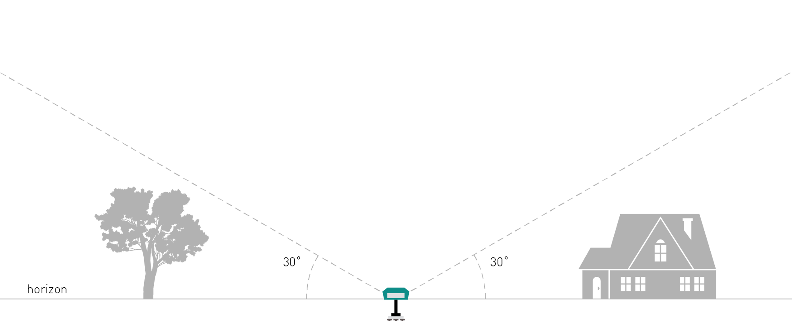
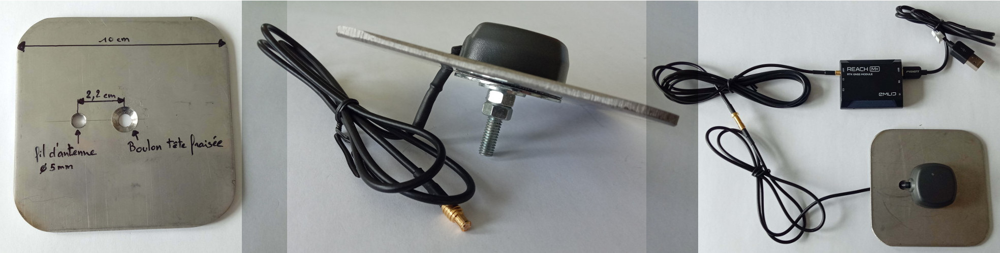
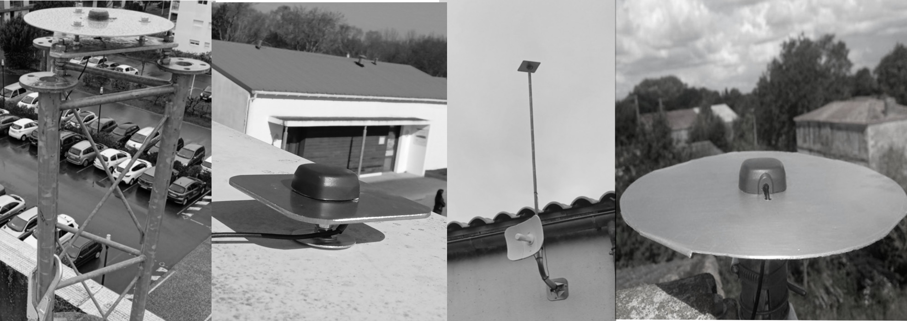
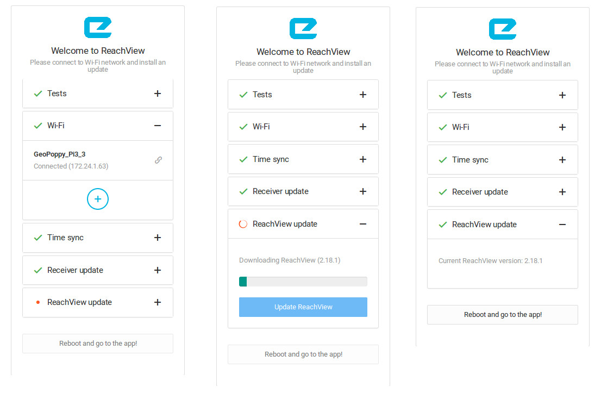
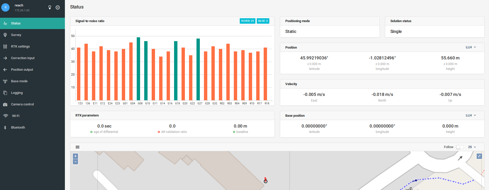

# 3 Installation d'une Base RTK 

Cette étape doit vous permettre de bien anticiper quel matériel acheter en fonction de la zone d'installation de l'antenne RTK et de vos possibilité de raccordement à un réseau internet pour diffuser les corrections produites

## 3.1 Matériel

### 3.1.1 Base RTK L1-L2 (F9P + Raspberry Pi)

Voici la liste des éléments nécessaires à la mise en place d'une base RTK L1-L2:

**Toute la procédure de montage et de paramétrage est [ICI](https://github.com/jancelin/rtkbase/wiki)**

|Matériel|Prix HT|
|--------|----|
|[F9P](https://store.drotek.com/rtk-zed-f9p-gnss)|200€|
|[D910 antenna](https://store.drotek.com/da-910-multiband-gnss-antenna)|100€|
|[Raspberry Pi 3/4](https://www.kubii.fr/les-cartes-raspberry-pi/2119-raspberry-pi-3-modele-b-1-gb-kubii-713179640259.html)|44€|
|[Micro SD 16Go](https://www.kubii.fr/carte-sd-et-stockage/2359-carte-microsd-16go-classe-10-u1-sandisk-kubii-619659161347.html)|11€|
|[Alimentation](https://www.kubii.fr/les-officiels-raspberry-pi-kubii/2593-alimentation-officielle-raspberry-pi-3-eu-micro-usb-51v-25a-kubii-3272496297586.html?search_query=SC0136&results=51)|10€| 
|[dissipateur de chaleur](https://www.kubii.fr/composants-raspberry-pi/1676-heat-sink-aluminium-pour-raspberry-pi-3-kubii-3272496005099.html)|1€|
|[cable antenne sma mâle tnc mâle 3m](https://www.mhzshop.com/shop/Cables-et-cordons/Sur-mesure/50-ohms-WiFi-4G/Cordon-sur-mesure-en-coax-faible-perte-WLL-240-2-4-5-GHz-6-1mm.html)|19€|
|[cable ethernet RJ45](https://www.mhzshop.com/shop/Cables-et-cordons/Cordons-reseau/)|6€|
|[boite étanche je-200](https://www.mhzshop.com/shop/Accessoires-MHz/Boites-etanches/Boite-etanche-avec-fixation-mat-203x203x65mm-GentleBOX-JE-200.html)|16€|
|TOTAL|407€|

## 3.1.2 Base RTK L1 (Emlid)

Voici la liste des éléments nécessaires à la mise en place d'une base RTK L1:

|Matériel|Prix HT|
|--------|----|
|[Emlid Reach M+](https://store.emlid.com/product/reachm-plus/)|240€|
|[Tallysman multi-GNSS antenna](https://store.emlid.com/product/tallysman-multi-gnss-antenna/)|54€|
|[Câble d'extension d'antenne](https://store.emlid.com/product/reach-antenna-extension-cable-2m/)|11€|
|[Feuille aluminium (plan de masse)](https://fr.rs-online.com/web/c/abrasifs-materiaux-techniques/tubes-feuilles-et-angles-en-aluminium/feuilles-en-aluminium/?searchTerm=aluminium&sort-by=P_breakPrice1&sort-order=asc&applied-dimensions=4294555449)|12€|
|[Alimentation](https://fr.rs-online.com/web/p/adaptateurs-ac-dc/1770223/)|6€|
|En Option||
|[Dissipateur chaleur](https://fr.rs-online.com/web/p/dissipateurs-de-chaleur/1263113/)|13€|
|[Pâte thermique](https://fr.rs-online.com/web/p/graisse-thermique/0554311/)|7€|

> scratch 3M ?

Un accès WIFI proche de la base est indispensable pour assurer la connexion du récepteur au réseau internet. Si ce n'est pas le cas, il est possible d'utiliser des CPL ethernet et wifi pour se déporter le réseau wifi vers la zone d'installation de votre antenne. Attention, dans cette configuration le CPL doit être connecté sur la même phase de votre réseau électrique que votre point d'accès à internet (Box).

> Exemple d'utilisation d'un RPI pour les réseaux wifi institutionnels ?

## 3.2 Choix de la zone d'implantation

La zone d'implantation de l'antenne de réception ne nécessite pas une position dominante, mais doit proposer une visibilité maximum du ciel ; il est indispensable de ne pas avoir d'obstacles (bâtiments, arbres, murs ...) sous les 30 premiers degrés par rapport à la base de l'antenne.

## 3.3 Installation de l'antenne de réception et du Reach M+

### 3.3.1 Installation de l'antenne de réception L1-L2

### 3.3.2 Installation de l'antenne de réception L1 EMLID

L'antenne [Tallysman multi-GNSS antenna](https://store.emlid.com/product/tallysman-multi-gnss-antenna/) doit être placée sur un plan de masse en métal ([préconisation du constructeur](http://www.tallysman.com/wp-content/uploads/Embedded-Antennas-Reference-Guide.pdf)) de 10 cm afin d'améliorer la réception des données satellitaires. Il peut être fabriqué en aluminium, inox ou cuivre. Il doit disposer d'un trou central pour le fixer avec un boulon tête fraisée sur un support (mât, toiture, borne béton...) et d'un deuxième trou pour faire passer le fil de l'antenne.
> [Note pour plus tard](https://www.fig.net/resources/proceedings/fig_proceedings/fig2017/ppt/ts08c/TS08C_zhang_schwieger_8513_ppt.pdf)

Coller ensuite l'antenne sur le plan de masse, rajouter le câble d'extension de 2 mètres si nécessaire (en fonction de la configuration de pose) et connecter le Reach M+.

Le Reach M+ doit être positionné dans un endroit abrité du soleil direct et de la pluie, si possible en intérieur et dans une zone lui permettant de capter le signal wifi de votre box. Si vous n'avez pas de wifi disponible, vous pouvez utiliser un [cpl wifi](https://www.boulanger.com/ref/8002139?xtor=SEC-1294-GOO&xts=171153&origin=pla&kwd=&gclid=EAIaIQobChMI1tTns9TN4wIVkEPTCh1dzAA7EAYYAiABEgKVZvD_BwE&gclsrc=aw.ds) ou un [Raspberry Pi](https://github.com/jancelin/geo-poppy/wiki/2.-Installation). Il est également possible de le connecter avec un avec un cable ethernet ([exemple de montage](https://jancelin.github.io/centipede/3_2_ethernet)) mais pas pour la phase de mise à jour (wifi uniquement).

Voici plusieurs exemples de montage de bases RTK :

En cas de montage extérieur, il est important de rajouter un dissipateur de chaleur sur le module RTK. La procédure de montage est disponible ici:

[Installation d'un dissipateur thermique](https://jancelin.github.io/centipede/3_1_dissipateur)

## 3.4 Premières configurations

Le Reach M+ est mis sous tension.

* Se connecter au réseau wifi du Reach ("reach:xx:xx") en utilisant le mot de passe __emlidreach__.

* Ouvrir un navigateur (de préférence Mozilla Firefox ou Google Chrome) et taper http://reach.local ou http://192.168.42.1 pour accéder à l'interface de configuration du reach

* Cliquer sur le bouton + et entrer le SSID de votre réseau wifi, le type de sécurité et le mot de passe. Cliquer sur le bouton Save.

* Sélectionner votre réseau wifi et cliquer sur Connect.

* Mettre à jour le Reach M+

* Reboot

* Une fois le reach connecté sur votre réseau wifi, une nouvelle IP lui est attribuée ; c'est celle-ci qui est utilisée par la suite (http://reach.local fonctionne également). Cette IP est visible sur l'interface Web du Reach, en haut à gauche de l'écran.

> Note : il est également possible de faire ces manipulations via l'application [ReachView](https://play.google.com/store/apps/details?id=com.reachview&hl=fr) (disponible sur Android et iOS) sur une tablette ou un smartphone.

