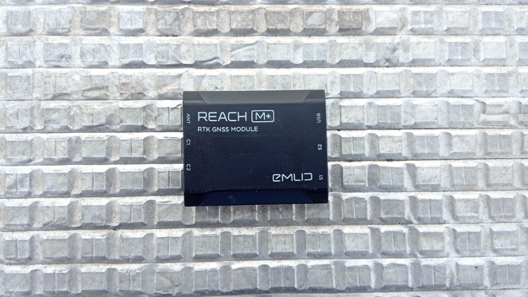
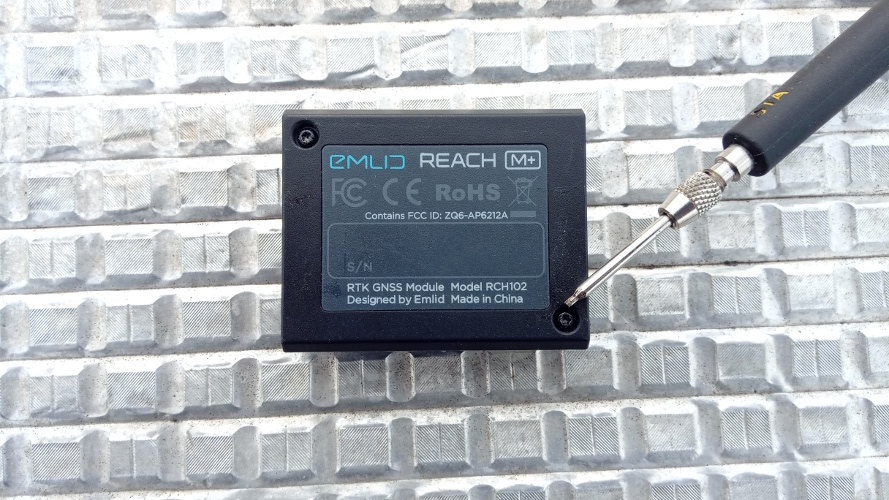
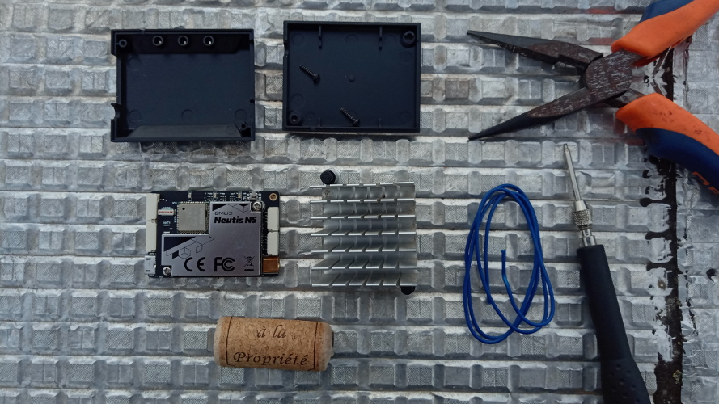
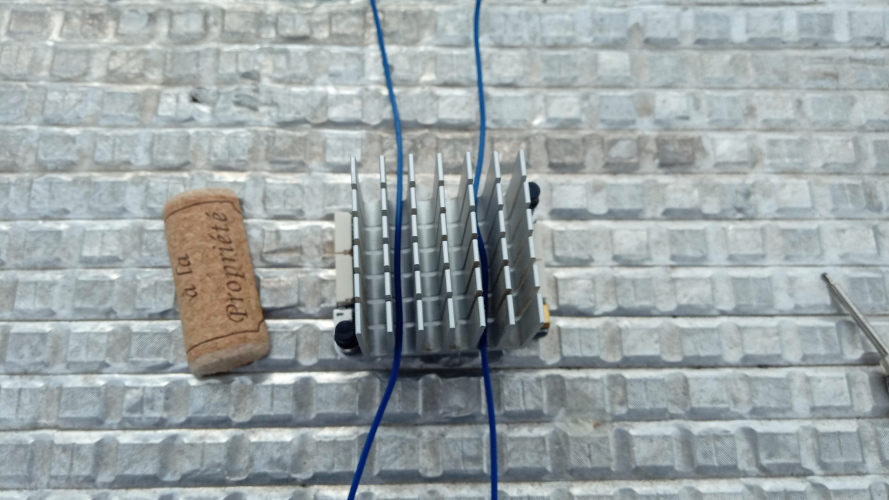
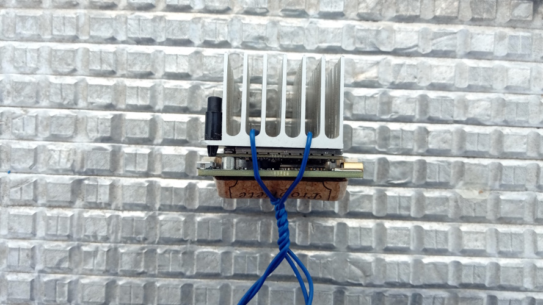
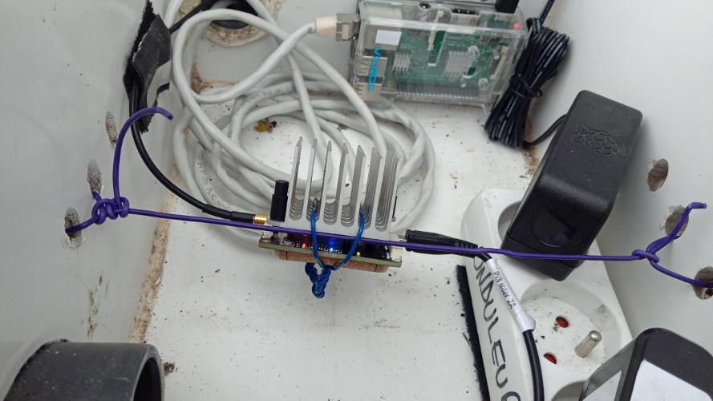
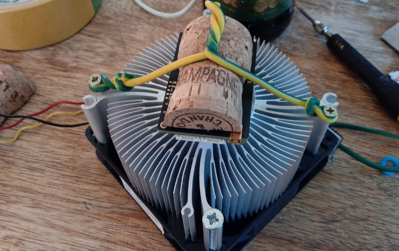
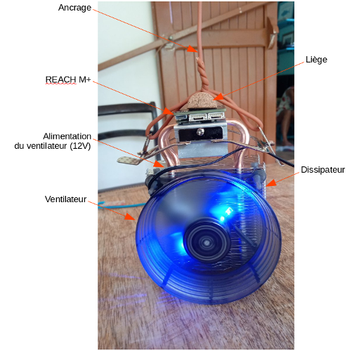

# 3.x  Régulation thermique

Les Bases RTK peuvent souffrir de la chaleur si elles ne sont pas protégées en étant dans un bâtiment régulé thermiquement. Une solution est de leur offrir un dissipateur (actif ou passif) de chaleur afin de les réguler.

## 3.x.1 Emlid Reach +

Il arrive régulièrement que l'Emlid Reach M+ chauffe ce qui entraîne sa déconnexion. Ce cas à été observé à la Réunion et sur la Rochelle, car les modules ne sont pas dans des bâtiments et exposés aux conditions climatiques extérieures.

Dans ce cas, il est important de rajouter un dispositif de dispersion de la chaleur au module.

En premier, récupérer un dissipateur de chaleur sur un ancien pc ou en acheter un neuf (avec ou sans ventilation en fonction du climat) et le monter comme le montre les images.

> !! Le montage est à faire de préférence avec de la pâte thermique entre le M+ et le dissipateur. !!

## 3.x.2 Exemples de montages avec dissipateurs et ventilations (conditions extrèmes)

