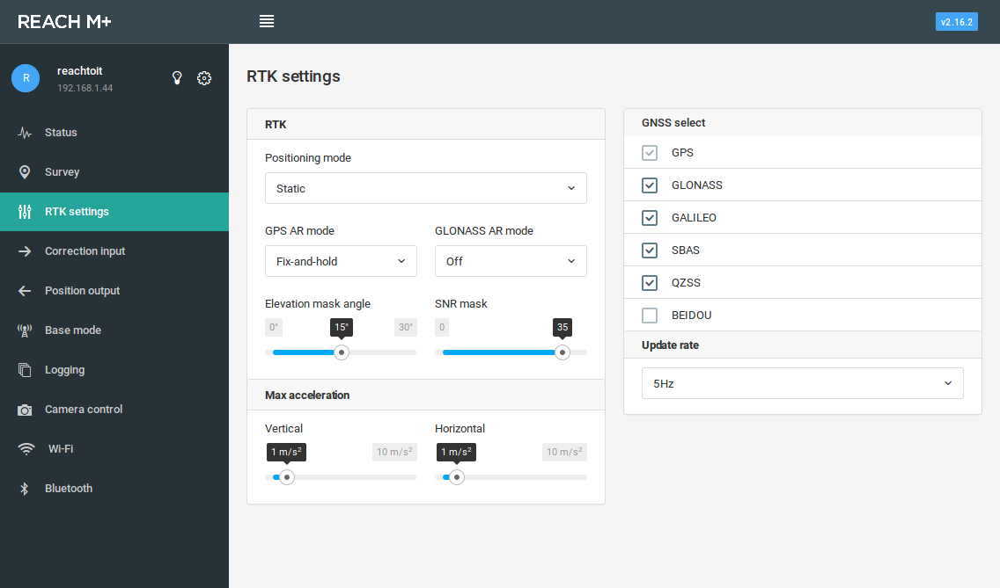
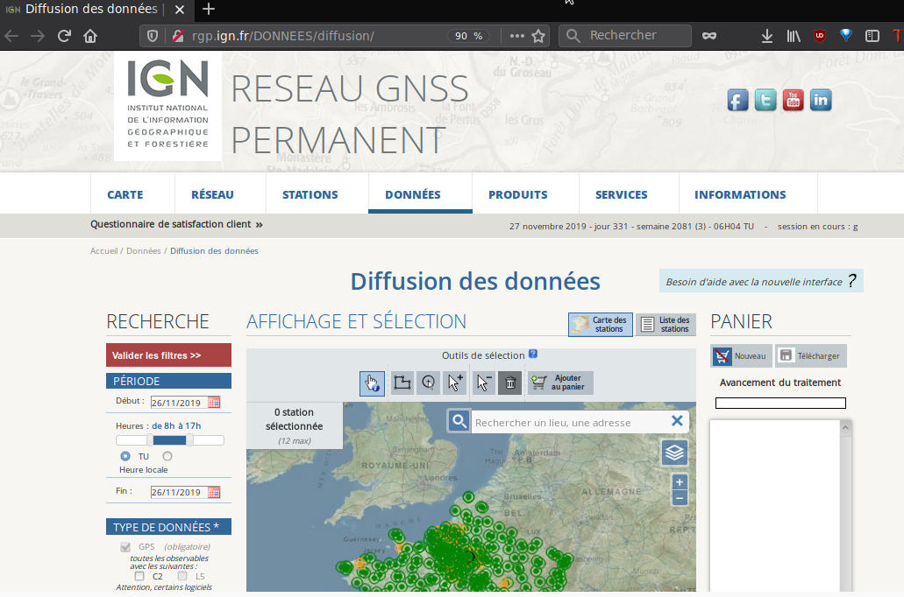
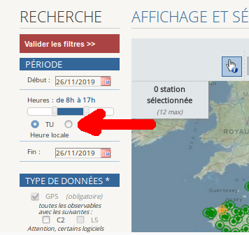
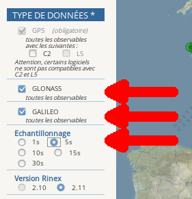
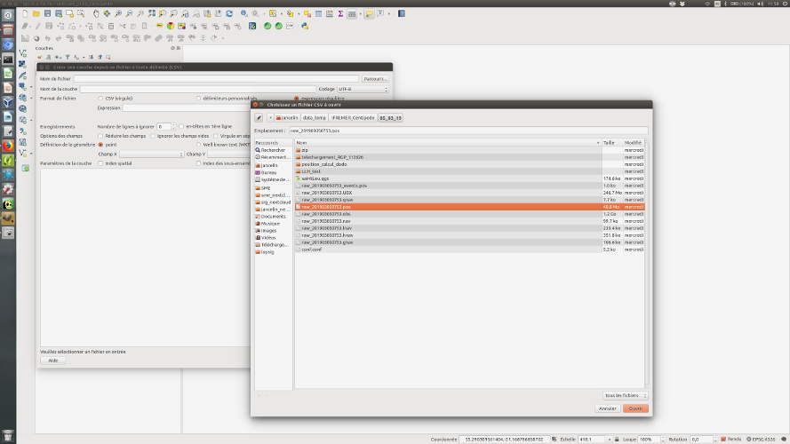
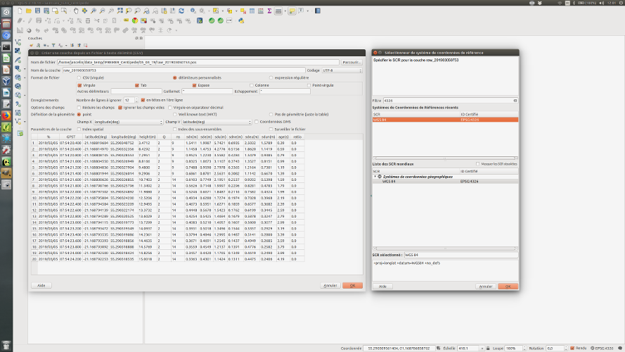
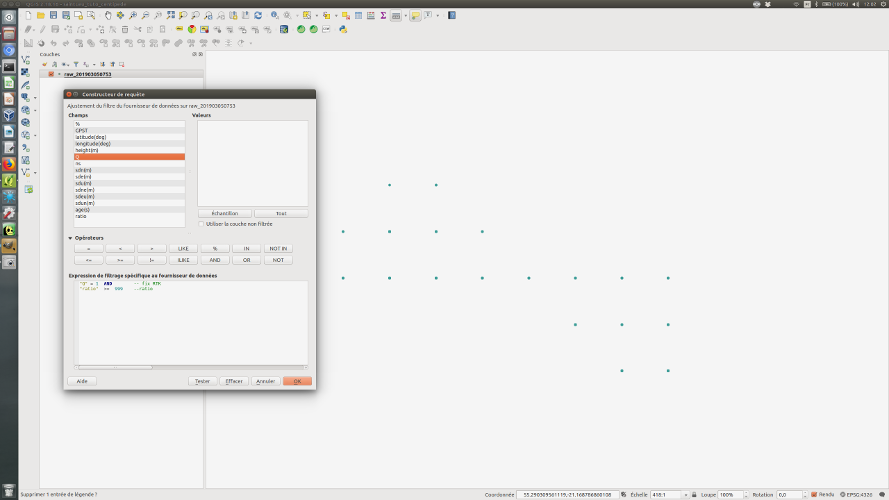
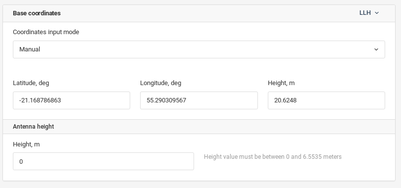
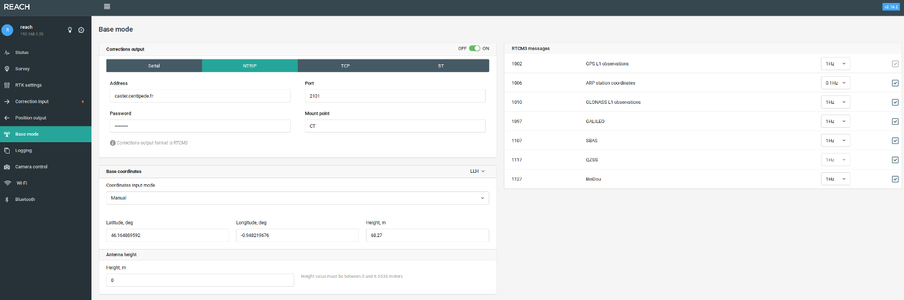

## 4 Calcul de la position de la base

Il est nécessaire maintenant de déterminer la position de la base le plus précisement possible.

Votre base va servir de référentiel pour vous mais aussi pour toute personne se trouvant dans sa zone d'action. Il est primordial que sa postion soit juste et très précise afin de pourvoir tous travailler sur un même référentiel géographique.

**Pour les utilisateurs de bases RTK F9P + Raspberry Pi**: [Télécharger](https://github.com/jancelin/rtkbase/wiki/3.-Param%C3%A9trage#param%C3%A9trage) le UBX.zip de votre choix sur votre Base (http://centipede.local:8000), décompresser le et rendez-vous à [cette étape](https://jancelin.github.io/centipede/4_positionnement.html#43-r%C3%A9cup%C3%A9rer-les-donn%C3%A9es-du-rgp)

### 4.1 Paramétrage de la position des satellites (matériel Emlid)

Paramétrer le recepteur en postionnnement static 



La valeur du *Update rate* conditionne le nombre de mesures par seconde. 

### 4.2 Récupération des données nécessaires (matériel Emlid)

Afin d'utiliser le reach en tant que base fixe, il est indispensable de définir ses coordonnées le plus précisément possible.
Pour ce faire, nous activons l'enregistrement des positions dans la rubrique logging, en activant l'option *Raw data* (position ON). Les options *Position* et *Base correction* ne doivent pas être activées pour l'instant.


L'enregistrement se fait pendant une période minimale de 12h00 consécutives. Les positions enregistrées sont ensuite post-traitées en s'appuyant sur la trame de l'antenne RGP la plus proche (IGN - <a href="http://rgp.ign.fr">En savoir plus</a>), enregistrée sur la même période. Plus l'antenne de référence sera proche, meilleure sera la précision de localisation de notre base.

Plusieurs méthodes de post-traitements existent, et ce sont les conditions locales (éloignement de l'antenne de référence, modèle de l'antenne,  visibilité de la constellation ...) qui aident à déterminer la méthode la plus pertinente.

* Télécharger le fichier UBX (Raw_xxx_UBX.zip) en cliquant sur l'icône.
> Le téléchargement n'est possible qu'en stoppant préalablement les logs (*Raw Data* sur OFF).

### 4.3 Récupérer les données du RGP

* Aller sur le [site IGN](http://rgp.ign.fr/DONNEES/diffusion)



* Zoomer large sur votre zone (50km)

* Sélectionner TU (Temps Universel)




* Changer la date de début et de fin en fonction du nom de votre fichier téléchargé précédement, et changer l'heure ```0 à 24h```

* Sélectionner GLONASS en plus de GPS (+ GALILEO si la base concernée le propose). Si un système sélectionné (ex : GALILEO) n'est pas disponible sur la base concernée, celle-ci disparait de l'interface cartographique et n'est donc plus sélectionnable. Dans ce cas, décocher le système de positionnement.

* Échantillonnage : 5 sec.

* Version Rinex : 2.11



* Il faut ensuite sélectionner la base souhaitée sur la carte à l'aide de l'outil de sélection puis l'ajouter au panier.

* Télécharger l'archive au format ZIP une fois celle-ci disponible.


* Réunir les 2 fichiers (UBX + Rinex) dans un même répertoire.

> [Pour en savoir plus sur les formats UBX et Rinex](https://en.wikipedia.org/wiki/RINEX)

### 4.4 Calcul de la correction

Télécharger la version d'RTKLIB fournie par EMLID (RTKLib for Reach RS2): [docs.emlid.com](https://docs.emlid.com/reachm-plus/common/tutorials/gps-post-processing/)


#### 4.4.1 RTKCONV

```
./rtkconv.exe
```

* Renseigner la date start et end (la même)
* Renseigner l'heure : start 00:01:00 et end 23:59:00
* Interval = 5s
* Unit= 24 h
* Charger le fichier UBX
* Sélectionner le format u-blox
* Cliquer sur options 
    * changer la version Rinex (2.11 : celle de la base RGP)
    * cocher ```Scan Obs Types``` ```Half Cyc Corr``` ```Iono Corr``` ```Time Corr``` ```Leap sec```
    * Satellite systems: ```GPS``` ```GLO``` ```GAL```
    * Observation types: ``` C L D S ```
    * Frequencies: ```L1``` ```L2```
    * Time Torelance (s): ```0```
* Cliquer sur Convert
* En sortie, nous récupérons 6 fichiers :
    - *.nav*, *.qnav*, *.lnav*, *.gnav*, *.hnav*, *.obs*
    
#### 4.3.2 RTKPOST

Deux méthodes sont proposées:

La première avec les fichiers récupérés 24 h après la collecte des données (positionnement précis).

La deuxième avec ces mêmes fichiers + les fichiers de l'IGS récupérés 20 jours après la collecte des données donc un positionnement très précis (Solution combinée finale GNSS pour la solution orbitale combinée du système d'information sur la dynamique de la croûte terrestre (CDDIS)). 

#### 4.3.2.1 Méthode à 24h

```
./rtkpost.exe
```

* Charger le fichier *.obs* de la base à corriger (Rover)
* Charger le fichier *.19o* de la base de référence (Base Station)
* Charger les fichiers *.nav*, *.hnav*, *.gnav*, *.lnav* de la base à corriger
* Le fichier résultat aura une extension *.pos*
* Renseigner le *Time Start* et le *Time End* (la plage horaire de notre période de logging).
* Cliquer sur __options__
  - __Setting1__
       - *Positionning Mode* : Static 
       - *Fréquencies* : L1 + L2 
       - *Elevation mask* : valeur configurée pour le reach (15° par défaut) 
       - *Ionosphere correction* : Broadcast  
            > Correction de l'effet de l'ionosphère. Il est conseillé d'utiliser le mode Broadcast (modèle utilisé en temps réel et disponible dans le fichier de navigation) ou Dual-Frequancy (si des mesures ou plusieurs fréquences sont disponibles).
            > Source : IGN cf. http://cours-fad-public.ensg.eu/mod/imscp/view.php?id=450 (Analyse GNSS sous RTKLIB, Fenêtre options)
       - *Troposphere correction* : Saastamoinen 
            > Correction de l'effet de la troposphère. Il est conseillé d'utiliser le mode Saastamoinen en positionnement utilisant des mesures de code ou en positionnement relatif avec de courtes lignes de base et de faibles dénivelés ; dans le cas contraire, on peut utiliser les modes Estimate ZTD ou Estimate ZTD+Grad (estimation de paramètres troposphériques).
            > Source : IGN cf. http://cours-fad-public.ensg.eu/mod/imscp/view.php?id=450 (Analyse GNSS sous RTKLIB, Fenêtre options)
       - Cocher Galileo si votre fichier RGP en contient.
       - Pour les autres options, laisser les valeurs par défaut 
  - __Setting2__
       - *Integer Ambiguity Res* : Fix and Hold
            > Stratégie de résolution des ambiguïtés. Les stratégies Continuous et Fix ans Hold sont les plus concluantes.
            > Source : IGN cf. http://cours-fad-public.ensg.eu/mod/imscp/view.php?id=450 (Analyse GNSS sous RTKLIB, Fenêtre options)
            >
            > (cf. aussi RTKLIB explorer qui privilégie le Continuous https://rtklibexplorer.wordpress.com/2016/04/05/rtklib-thoughts-on-fix-and-hold/
            >   https://rtklibexplorer.wordpress.com/2016/05/02/another-kayak-data-set-fix-and-hold-fails-again/   http://rtkexplorer.com/improving-rtklib-solution-ar-lock-count-and-elevation-mask/ ) 
       - Toutes les autres options doivent rester par défaut
  - __Output__ : laisser les valeurs par défaut 
  - __Statistics__ : laisser les valeurs par défaut 
  - __Positions__ 
       - Changer la valeur de *Base station* : Rinex Header Position 
  - __Files__ : laisser les valeurs par défaut 
  - __Misc__ : laisser les valeurs par défaut
 
> Penser à sauvegarder tous ces paramétrages dans un fichier .conf (option Save)

#### 4.3.2.2 Méthode après 20 jours

* Récupérer la date GPS de la collecte de données: http://navigationservices.agi.com/GNSSWeb/
> par exemple le 5 février 2019 correspond au 2039:2
* se rendre sur le site ftp://cddis.nasa.gov/gnss/products/
* chercher le dossier correspondant à la date GPS et l'ouvrir
> dans notre exemple 2032
* Chercher le Fichier :igs"dategps+jour".sp3.Z , télécharger le et décompressez-le
> dans l'exemple: Fichier :igs20392.sp3.Z > igs20392.sp3
* Ouvrir RTKPOST
```
./RTKPOST_Qt-x86_64.AppImage
```

* Charger le fichier *.obs* de la base à corriger (Rover)
* Charger le fichier *.19o* de la base de référence (Base Station)
* Charger les fichiers *.nav*, *.hnav*, *.gnav*, *igs20392.sp3* de la base à corriger
* Renseigner le *Time Start* et le *Time End* (la plage horaire de notre période de logging).
* Reprendre la procédure décrite précédemment (2.1 __Méthode à 24h__) au niveau de * Cliquer sur __options__

  
### 4.3.3 RTKPLOT
 
 ```
./rtkplot.exe
```
 
 Pour cartographier le nuage de points obtenu précédemment (fichier avec extension pos).
 
 Il est possible à ce stade-là de filtrer les données afin de ne conserver que les points pour lesquels la valeur de Q est égale à 1 (ie. mode FIX).
 
## 4.4 QGIS
 
 Le fichier résultat peut être exploité dans QGIS3.
 
 > Plus d'informations sur l'installation de ce logiciel sur cette [page](https://qgis.org/fr/site/)
 
   - Cliquer sur *couche* > *Ajouter une couche* > *Ajouter une couche de texte délimité*
   - Choisir le fichier .pos puis cliquer sur *Ouvrir*
        
   

   - Dans *Format de fichier*, sélectionner le délimiteur personalisés *Espace*
   - Fixer la valeur du *Nombre de lignes à ignorer* à 26
   - Cocher "Ignorer les champs vides"
   - Cocher l'option "Entêtes en 1ere ligne", "Déteceter les types de champs" et "Ignorer les champs vides"
   - Définition de la géométrie: cocher "Point"
   - Sélectionner le SRC 4326 (WGS 84)
   - Cliquer sur *OK*
   


   - Faire un clic droit sur la couche puis *Filtrer...*
   - Ajouter le filtre suivant :

```
 "Q"=1 AND
"ratio" >= 50 AND
"sdeu(m)" = 0 AND
"sdne(m)" = 0

  ```
   - Cliquer sur *OK*
   
On retrouve ici les points affichés dans RTKPLOT suite à l'application des mêmes filtres (mode FIX). Les points, même nombreux, ne devraient pas être éloignés les uns des autres de plus de quelques mm à 1-2cm.
   


   - Cliquer sur *vecteur* > *Outils d'analyse* > *Statistiques basiques pour les champs*
        - *Couche vectorielle en entrée* : choisir le fichier pos
        - *Champ pour le calcul des statistiques* : latitude
        - Cliquer sur *Executer*
        - Récupérer la valeur 'MEDIAN' ex: 46.164793681
   - Répéter l'opération avec les champs longitude et hauteur.
   - Voici un exemple de coordonnées récupérés 46.164793681 -0.948418958 63.0686, ceci est la postion précise de votre base RTK

## 4.5 Insertion des coordonnées corrigées
 
### 4.5.1 F9P + Raspberry Pi

Insérer la valeur dans settings.conf puis ```F2 > Stop Rtcm3``` & ```F2 > Start Rtcm3``` 

https://github.com/jancelin/rtkbase/wiki/3.-Param%C3%A9trage#param%C3%A9trage

### 4.5.2 Emlid

 Ces valeurs doivent être enregistrées dans la rubrique *Base mode* de l'interface du Reach.
 
   Dans l'onglet *Base coordinates* (LLH), mettre le *Coordinates input mode* sur Manual puis enregistrer les valeurs de longitude, latitude et hauteur.
   

 
> Dans nos conditions expérimentales, nous avons obtenu une précision inférieure à 1 centimètre. :+1:

## 4.6 Connexion de la base au caster

Avant de pouvoir utiliser le réseau Centipède il est indispensable de faire une demande de connection au Caster (gratuit et sans obligations). les demandes sont à envoyer à contact@centipede.fr en précisiant:

   - Votre situation géographique (commune)
   - Nom, prénom
   - Adresse mail
   - Type de matériel utilisé pour la base RTK
   - Proposition de nom de Mout Point ( entre 3 et 5 caractères)
   
   
### 4.6.1 F9P + Raspberry Pi

Rien à faire de plus

### 4.6.2 Emlid

Pour connecter la base au caster, se rendre dans la rubrique *Base mode* de l'interface du reach :



Modifier les valeurs suivantes (en se basant sur les paramètres enregistrés dans *ntripcaster.conf*)

   - Choisir l'option *NTRIP*
   - Indiquer l'URL du caster dans le champ *Address* : caster.centipede.fr
   - Choisir le port 2101
   - Indiquer le mot de passe: centipede
   - Choisir/Indiquer le nom du Mount point
   
> Votre base est immédiatement opérationnelle mais n'apparaitra sur la [carte](https://centipede.fr/index.php/view/map/?repository=centipede&project=centipede) et bénificiera des options du service (mail d'alerte en cas de déconnection, visibilité de sa position et de son état) seulement après validation par l'administrateur.

------------------------------------------------------------
