# 9.1 Une Balise Open Source pour le monitoring des océans

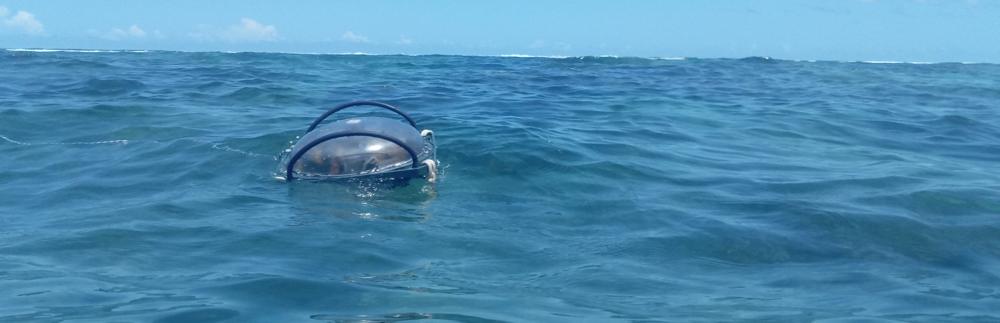

<i>Balise Champagne prototype V0.1 dans le lagon de Saint Leu (la Réunion)</i>

#### Mission conjointe: IFREMER / INRA

Date: Mars 2019

Collaborateurs: [Julien Ancelin](https://www.linkedin.com/in/jancelin) (INRA), [Sylvain Bonhommeau](https://www.linkedin.com/in/sylvain-bonhommeau-3790035/) (IFREMER), [Wilfried Heintz](https://www.dynafor.fr/heintz-wilfried) (INRA), [Sylvain Poulain](https://www.linkedin.com/in/sylvainpoulain/) (GISCAN), [Julien Barde](https://www.linkedin.com/in/julien-barde-1692282/) (IRD) , [Anne-Elise Nieblas](https://www.linkedin.com/in/anne-elise-nieblas-91228316/) (COOOL Research)

Licence: [AGPL-3.0](https://github.com/jancelin/centipede/blob/master/LICENSE)

L’acquisition de données dans le milieu marin pour des problématiques climatiques est un enjeu majeur à l’échelle internationale. Cependant, les instruments d’acquisition sont généralement très onéreux, spécialisés pour certains champs disciplinaires et dont les spécifications techniques et logicielles sont protégées par les éditeurs. La démocratisation de l’électronique libre, des projets open-source / open-data et des objets connectés offrant des solutions de communications à bas coût ont le potentiel de modifier complètement le panorama de l’observation en sciences marines.

Les défis à relever sont la capacité à collecter et transmettre des données fiables et de manière autonome en termes d’énergie.

Ce projet est consacré au développement de balises capables de collecter des données (hauteur de l’eau, houle, marée) grâce à un capteur [GNSS RTK](https://fr.wikipedia.org/wiki/Cin%C3%A9matique_temps_r%C3%A9el) . Cette première mission à la Réunion (mars 2019) est ainsi l’occasion de tester les développements concernant le système de transmission et la capacité de récupérer des volumes de données permettant le monitoring de données océanographiques.

### Utilisation du réseau Centipède 
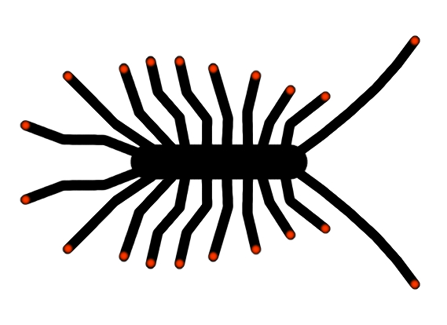

Le projet [Centipède](https://github.com/jancelin/centipede) vise à créer un réseau de bases RTK ouvertes et disponibles pour toute personne se trouvant dans la zone de couverture. Cette technologie permet entre autres à des instituts de recherche d’effectuer des relevés expérimentaux en haute précision géographique, de manière autonome, à faible coût et avec des outils et méthodes Open Source.

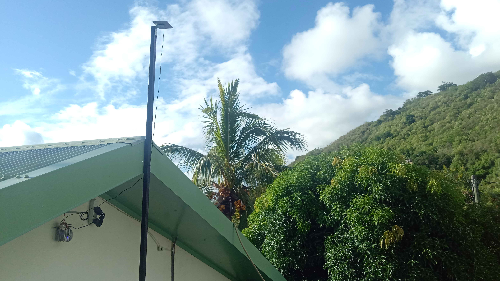

<i>Prototype Base RTK DODO installée à Saint-Leu</i>

Le premier objectif de cette mission était de mettre en place une base de référence capable de corriger les signaux satellitaires pour atteindre une précision centimétrique des mesures en temps réel. L'installation a permis de tester la résistance des composants électroniques à la chaleur et l'humidité ambiante ainsi que de fiabiliser la méthode de calcul de son positionnement grâce au [RGP](http://rgp.ign.fr/DONNEES/diffusion/). Une documentation est disponible [ici](https://github.com/jancelin/centipede/blob/master/tuto/note.md) pour reproduire pour vos propres besoins le montage et le paramétrage de la base. Le signal de correction [RTCM3](https://gssc.esa.int/navipedia/index.php/DGNSS_Standar) produit est diffusé en [OpenAccess](https://centipede.sig.inra.fr/websig/lizmap/www/index.php/view/map/?repository=demo&project=situation&layers=000B0FTTTTT&bbox=6111963.33863%2C-2432798.069284%2C6208656.179397%2C-2382464.286165&crs=EPSG%3A3857), via un [NTRIP BroadCaster](https://igs.bkg.bund.de/ntrip/caster) utilisable dans une zone d'action de 10 km de rayon autour de la base.

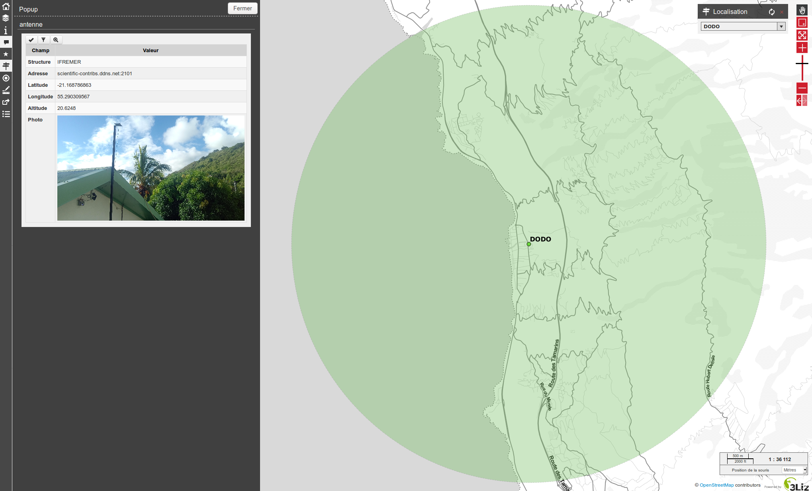

<i>Situation, adresse du caster et zone d'action de la Base DODO</i>

Cette limite garantie la précision de la mesure car le matériel utilisé n'est capable d'utiliser que la fréquence L1 des Satellites GNSS, au-delà, une variabilité supplémentaire risque d'être induite et demande donc d'installer une nouvelle base. Cependant, l'arrivée prochaine de nouvelles puces informatiques à faible coût devrait permettre de travailler sur les fréquences L1 et L2, permettant ainsi de garantir un signal de correction sur des distances allant jusqu'à 50km de la base de référence.

### Test d'acquisition en RTK

Différents tests de validations de la position de la bases ont été effectués via des post-traitements et des mesures par rapport aux stations de référence du RGP. Des tests sur terre ont également été réalisés pour vérifier la fiabilité du signal de correction et sa disponibilité en continu.

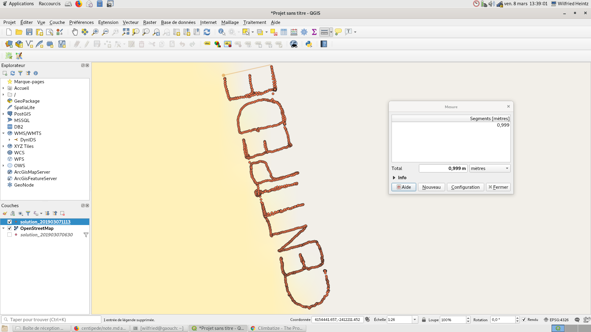

<i>Test d'acquisition de points en RTK</i>

Malgré le positionnement obligatoire de la base RTK nomé "DODO" proche des reliefs du bord de côte de L'île de la Réunion, la disponibilité du signal de correction est rapide, fiable et continu avec une bonne disponibilité satellitaire.

<i>Test haute précision (40cm X 40cm) d'acquisition de points en RTK</i>

### Conception de la balise

Ce premier prototype s'inspire des expériences de l'équipe de [SONEL](https://lienss.univ-larochelle.fr/SONEL-Systeme-d-Observation-du-Niveau-des-Eaux-Littorales-518) ( Système d'Observation du Niveau des Eaux Littorales) qui rassemble et diffuse des observations du niveau marin à la côte enregistrées par des marégraphes de la meilleure qualité métrologique possible. Les chercheurs disposent ainsi d'éléments qui leur permettent de répondre aux questions relatives aux changements qui affectent les différentes composantes du niveau de la mer. Cette équipe a développé des bouées GPS mesurant le niveau de la mer à une "résolution de 1 à 2.2 cm par rapport à des marégraphes conventionnels, ce qui est satisfaisant pour des applications marégraphiques et offre d’intéressantes perspectives pour les futures études sur l’évolution du niveau de la mer" ([Andre, Gael & Martin Miguez, Belen & Ballu, Valérie & Testut, L & Woppelmann, Guy & Tiphaneau, Pascal. (2014). La mesure du niveau de la mer par bouées GPS : l’expérience multi-capteurs de l’île d’Aix.](https://www.researchgate.net/publication/291171973_La_mesure_du_niveau_de_la_mer_par_bouees_GPS_l'experience_multi-capteurs_de_l'ile_d'Aix)).

Les mesures de ces bouées GPS ont été réalisées en mode GNSS single puis post-traitées en mode cinématique en utilisant une station du réseau GNSS permanent de l’IGN. Ce processus nécessite de récupérer manuellement et de manière régulière les données des récepteurs, puis d'effectuer un traitement informatique assez complexe. Les résultats ne sont disponibles qu'a posteriori. L'idée de la mise en place de ce nouveau prototype est d'utiliser la technologie RTK afin de disposer de données fiables, instantanées et de pouvoir ainsi monitorer les océans en temps réel.

De plus, SONEL utilise des récepteur GPS propriétaire coûteux et dont l'acquisition n'est pas à la portée de tous les laboratoires de recherche. Ce prototype devra donc être le moins cher possible, open-source et facilement reproductible.

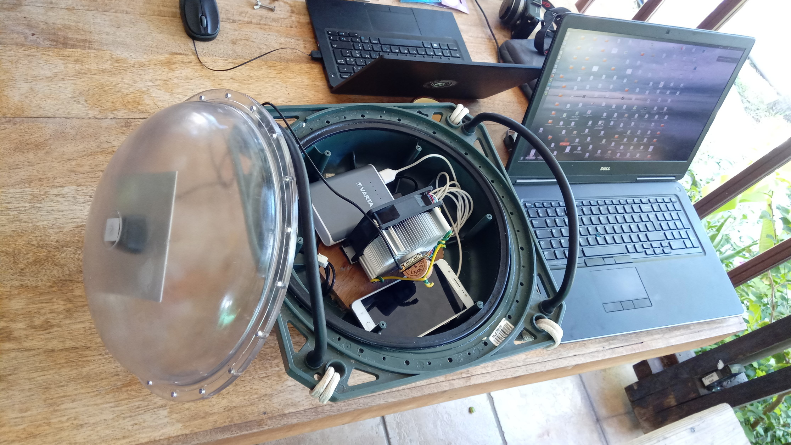

<i>Finalisation du montage de la balise avant mise à l'eau</i>

Le prototype version 0.1 est nommé "Champagne". Il est composé d'un module [Emlid Reach M+](https://emlid.com/reach/) embarquant une puce [Ublox NEO-M8T](https://www.u-blox.com/en/product/neolea-m8t-series) mono fréquence, un Opérating système Linux, le logiciel [RTKLib](http://www.rtklib.com/) et enfin [ReachView](https://docs.emlid.com/reachm-plus/common/reachview/), une web interface permettant le paramétrage simplifié de RTKlib. L'ensemble des codes du M+ sont disponibles [ici](https://github.com/emlid). Une antenne de réception multi-GNSS Tallysman est montée sur un ground Plane de 12 cm en aluminium. Afin de recevoir le signal RTM3 de correction RTK et renvoyer les données dans une base de données centrale, un smartphone avec un forfait 4G est utilisé, il sera remplacé par une clé USB 4G compatible prochainement. Le tout est alimenté avec une batterie externe USB en attendant un montage autonome en électricité via des panneaux solaires.

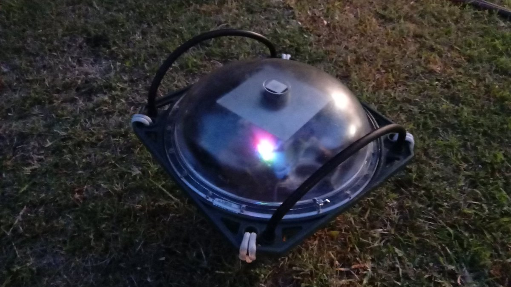

<i>Balise montée et test de positionnnement RTK</i>

### Prix du matériel

|Matériel|Prix HT|
|--------|----|
|[Emlid Reach M+](https://store.emlid.com/product/reachm-plus/)|240€|
|[Tallysman multi-GNSS antenna](https://store.emlid.com/product/tallysman-multi-gnss-antenna/)|54€|
|[Modem USB](https://www.ebay.com/itm/ZTE-MF823-USB-Broadband-modem-4G-LTE-Mobile-Dongle-FDD-B3-B7-B20-1800-2600-800/271819147163?hash=item3f49af079b:g:5dYAAOSw37tWAVzz)|32€|
|[Carte SIM et forfait 4G 40Go](https://www.red-by-sfr.fr/forfaits-mobiles/forfait-4G-1Go-sans-engagement/)|10€/mois|
|[Dissipateur chaleur](https://fr.rs-online.com/web/p/dissipateurs-de-chaleur/1263113/)|13€|
|[Pâte thermique](https://fr.rs-online.com/web/p/graisse-thermique/0554311/)|7€|
|[Feuille aluminium (Ground plane)](https://fr.rs-online.com/web/c/abrasifs-materiaux-techniques/tubes-feuilles-et-angles-en-aluminium/feuilles-en-aluminium/?searchTerm=aluminium&sort-by=P_breakPrice1&sort-order=asc&applied-dimensions=4294555449)|12€|
|[Rubans auto-agrippant](https://fr.rs-online.com/web/p/rubans-auto-agrippant/7117556/)|27€|
|[Power Bank 20000mAh](https://fr.rs-online.com/web/p/batteries-externes/1744611/)|38€|
|[Chargeur solaire (à tester)](https://fr.rs-online.com/web/p/chargeurs-solaires/1768894/)|176€|
|Bouée | |

### Test de la balise

Ce premier test est réalisé dans le [lagon de Saint-Leu](https://www.openstreetmap.org/search?query=saint%20leu#map=13/-21.1817/55.3431) (la Réunion) avant son positionnement permanent au large du lagon. Cette situation à permis de vérifier facilement et régulièrement son bon fonctionnement et d'effectuer d'autres tests à proximité pendant l'acquisition avec d'autres matériels terrestre.

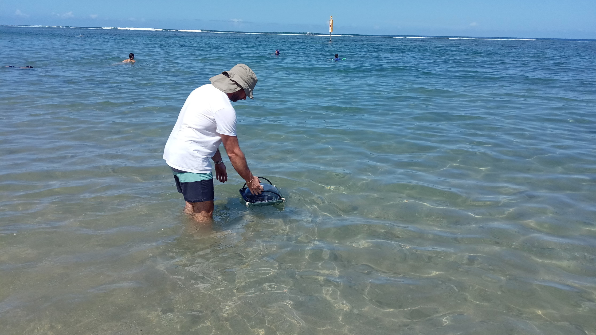

<i>Mise à l'eau de la balise pour test d'étanchéité</i>

Une première phase de test à été effectué pour vérifier la bonne étanchéité de la balise, son effet "bouchon", sa capacité à récupérer la trame RTCM3 de la base Centipede "DODO" et avoir un "fix" RTK (Q=1 et AR ratio=999.99) constant afin de garantir une donnée de qualité (+- 2 cm en altimétrie par rapport à nos estimations en mesures statiques).

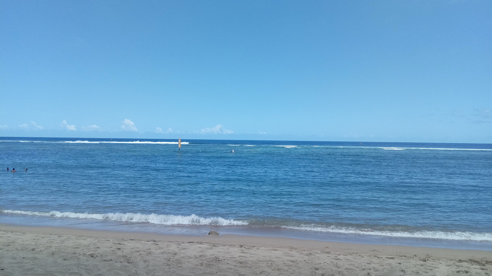

<i>Installation de la balise dans le lagon</i>

La balise à été fixée à un poteau délimitant l'une des [réserves marine de la Réunion](http://www.reservemarinereunion.fr/images/reserve/pdf/decrets/carte_rnmr_.pdf) et a acquis des données de longitude, latitude, altimétrie, fix GNSS, variabilité de la position et qualité du signal pendant une durée de quatre heures.

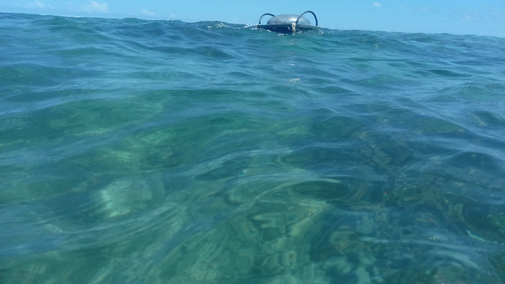

<i>Acquisition continue en RTK de sa position: longitude, latitude et altimétrie</i>

### Premiers résultats

La fréquence d'acquisition des données était de 5 HZ soit 5 données par secondes, cela représente une quantité non négligeable en terme de volume, mais permet de récupérer l’essentiel et le fiable suite au nettoyage des données aberrantes sur cette courte période de mesure. La balise n'a pas montré de perte de données ni de coupure pendant l'acquisition et les composants n'ont pas eux d'effets de surchauffe malgré l'ambiance confinée de la balise étanche et la bulle de protection transparente (effet de serre). Un effet "bouchon" à été observé visuellement lié à la morphologie du matériel, l'effet clapot, le courant et le vent présent dans le lagon. L'analyse des données à montrée une influence de son point d'accroche avec un effet de masque (poteau en métal influençant la réception des données satellitaires) quand la balise se trouvais à proximité. Néanmoins, il semble à première vue que les données collectées concordent et permettent de monitorer les cycles et périodes des mouvements des océans.

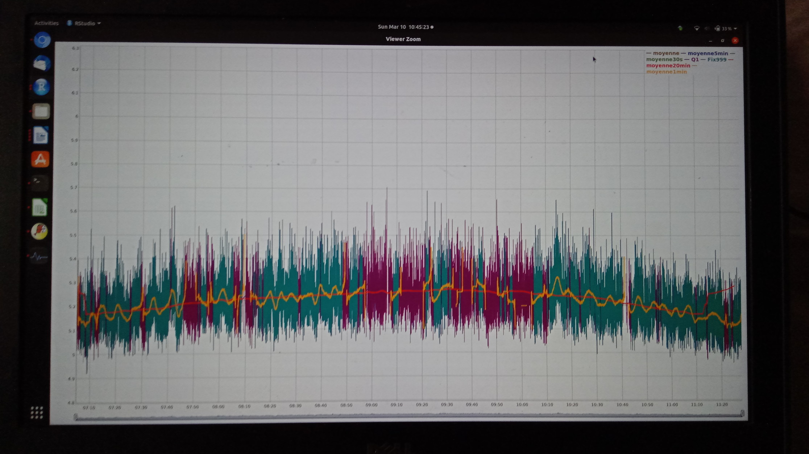

<i>Premier Traitement sous Rstat des données collectées</i>

### Enfin...

Il nous reste maintenant à lancer des tests en continue et en autonomie énergétique. Il sera nécessaire également de se comparer aux autres bouées du même type (matériel SONEL par exemple) afin de d'estimer la variabilité de nos mesures, de déterminer si ce mode de collecte de données est fiable et à quelle niveau de précision nos données converges.

A suivre...
