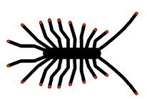

# Centipède : le RTK en réseau ouvert pour géolocaliser les données environnementales et autoguider les véhicules agricoles

## 1. Le Projet

Les instituts de recherche comme l’Inra et le CNRS utilisent la géolocalisation pour référencer leurs données environnementales. Mais la précision des systèmes de navigation par satellite, qui dépend des conditions atmosphériques, n’est que de quelques mètres. Des systèmes de correction différentiels peuvent pallier ce manque de précision : le cinématique temps réel (Real Time Kinematic) permet ainsi d’approcher la précision centimétrique. Mais ce système nécessite une base de référence à proximité du lieu de collecte, l’accessibilité de son signal, un matériel et une location du signal extrêmement coûteux. Depuis quelques années, des développeurs travaillent d’arrache-pied avec les logiciels Opensource et l’Open Harware pour créer des solutions peu coûteuses, légères, faciles d’utilisation et fiables.

Le projet Centipède vise à créer un réseau de bases RTK ouvertes et disponibles pour toute personne se trouvant dans la zone de couverture. Le réseau, ouvert, pourra également être complété et étendu. Le projet est développé et coordonné par la plateforme DISA (CNRS/INRA) en se basant sur l’implantation géographique des instituts de recherche de Charente-Maritime Nord pour offrir une couverture totale du territoire dans le triangle La Rochelle, Rochefort et Niort. Il est soutenu financièrement par la Région Nouvelle-Aquitaine et mutualise les moyens entre le Geves du Magneraud, le LIENSs (CNRS/Université de La Rochelle), l'INRA de Saint-Laurent-de-la-Prée et la Zone atelier Plaine & val de Sèvre. Cette technologie permettra entre autres à ces instituts et aux acteurs extérieurs, d’effectuer des relevés expérimentaux de haute précision géographique, d’accomplir des relevés photographiques grâce aux drones volants et d’automatiser la conduite haute précision des véhicules agricoles afin d’augmenter la précision, la qualité et la traçabilité des interventions. Un prototype de système d’autoguidage haute précision Open Source est également en cours de test, il permettra d’équiper un matériel de traction pour seulement 1000 €.
