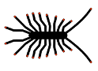

### Home Centipede

## Le Real Time Kinematic collaboratif, ouvert et Open Source  🛰️ 🛰️ 🛰️ 

## Sommaire 

* [1. Projet Centipede](https://jancelin.github.io/centipede/1_projet.html)

* [2. RTK ? ](https://jancelin.github.io/centipede/2_RTK.html)

* [3. Installation d’une Base RTK](https://jancelin.github.io/centipede/3_0_montage.html)

   * 3.1 Matériel utilisé
   
   * 3.2 Choix de la zone d'implantation
   
   * 3.3 Installation de l'antenne de réception et du Reach M+
   
   * 3.4 Premières configurations
   
* [3.x Régulation thermique](https://jancelin.github.io/centipede/3_1_dissipateur.html)

  * 3.x.1 Emlid Reach +
  
  * 3.x.2 Exemples de montages avec dissipateurs et ventilations (conditions extrèmes)
    
* [3.y Utilisation d’un câble ethernet à la place du wifi](https://jancelin.github.io/centipede/3_2_ethernet.html)

  * 3.y.1 Matériel à prévoir en plus
  
  * 3.y.2 Montage
  
  * 3.y.3 Test

* [4. Calcul de la position de la base](https://jancelin.github.io/centipede/4_positionnement.html)

  * 4.1 Paramétrage de la position des satellites
  
  * 4.2 Récupération des données nécessaires
  
  * 4.3 Calcul de la correction
  
    * 4.3.1 RTKCONV
  
    * 4.3.2 RTKPOST
    
      * 4.3.2.1 Méthode à 24h
      
      * 4.3.2.2 Méthode après 20 jours
      
    * 4.3.3 RTKPLOT
    
   * 4.4 QGIS
   
   * 4.5 Insertion des coordonnées corrigées
   
   * 4.6 Connexion de la base au caster

### Exemples d'utilisations

* [9.1 Une Balise Open Source pour le monitoring des océans](https://jancelin.github.io/centipede/9_1_Balise_Reunion.html)
