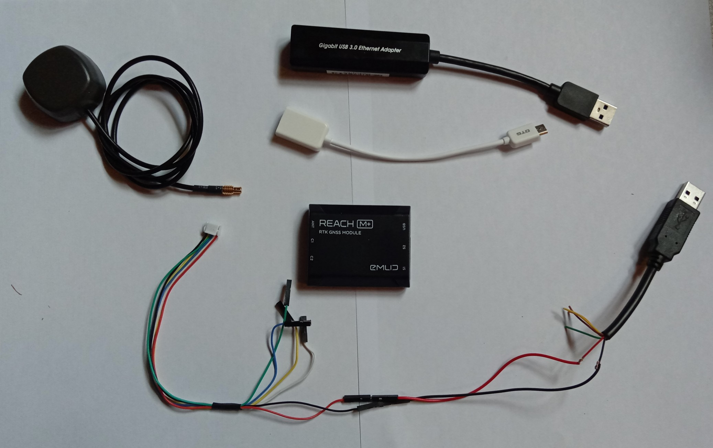
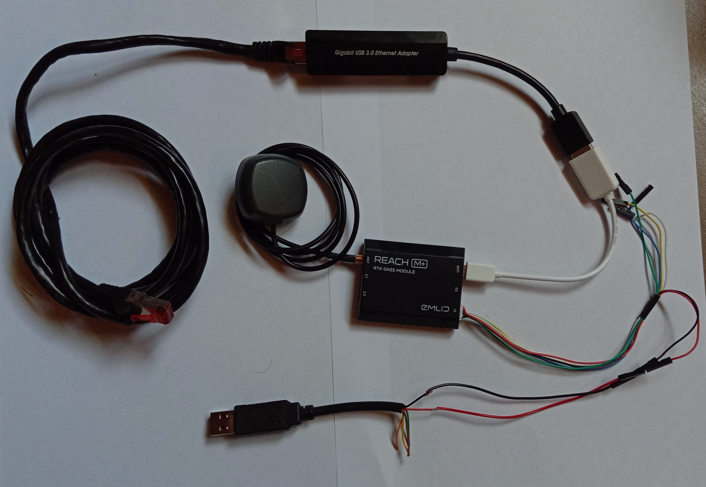

**Utilisation d'un câble ethernet à la place du wifi**

L'utilisation du wifi peut être contraignant en fonction du placement de la base RTK, de plus ce moyen de communication avec le réseau entraîne de coupures.

Dans ce document, nous allons brancher un module emlid reach M+ directement sur un cable ethernet.

*Matériel à prévoir en plus*

* [un module ethernet to USB: 32€](https://fr.rs-online.com/web/p/products/1447999/?grossPrice=Y&cm_mmc=FR-PLA-DS3A-_-google-_-CSS_PLA_FR_FR_Informatique_Et_P%C3%A9riph%C3%A9riques-_-R%C3%A9seaux_Et_Connectivit%C3%A9%7CAdaptateurs_D%27Interface-_-PRODUCT_GROUP&matchtype=&pla-627275384809&gclid=EAIaIQobChMI0uqsz4PL4wIVxEPTCh1P8wFLEAQYASABEgKqIvD_BwE&gclsrc=aw.ds)

* Un vieux câble usb

* le cable JST-GH fourni avec le Reach M+

* le câble adaptateur OTG fourni avec le Reach M+

*Montage*

* couper votre câble USB pour récupérer le fil rouge et le noir.

* raccorder les fils au cable JST-GH port afin d'alimenter le Reach M+

* Connecter l'adaptateur ethernet USB au câble OTG et ce dernier au Reach M+

* Connecter le câble fabriqué précédemment dans le port S1 du M+

* Connecter l'antenne

*Test*

Pour vérifier le montage, connecter un câble ethernet (connecté à votre réseau) à l'adaptateur et alimenter en USB via un transformateur 220V -> 5V (smartphone), un port USB PC ou une batterie externe.

Une fois que le Reach M+ est démarré (les 3 leds allumés), se connecter au Hotspot et vérifier qu'il accède bien au web. Une des meilleures techniques est d'ajouter une "correction input" via le réseau centipede et voir s'il reçoit bien les données.
