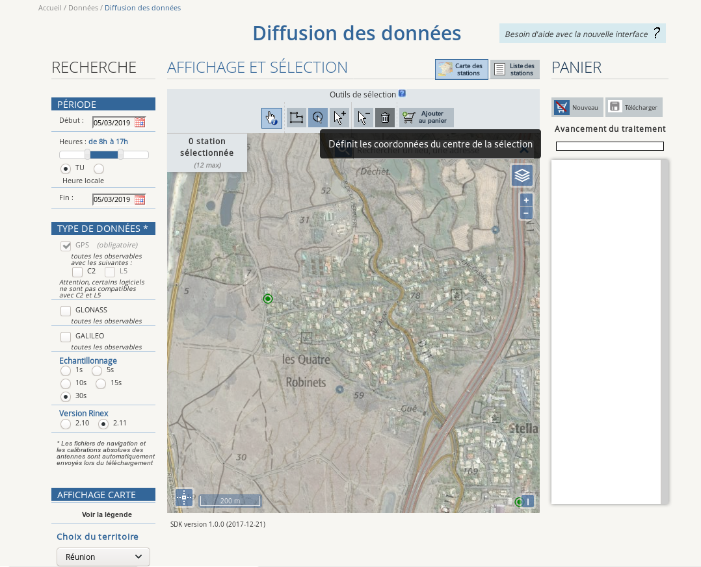

# Mise en place d'une antenne RTK (site de Saint-Leu - Ifremer - Réunion)

*Modèle Emlid Reach M+ - v2.16.2*

## Installation du module

La température locale et l'humidité relative étant très élevées, il est nécessaire de retirer le module du boitier et de lui adjoindre un ventilateur équipé d'un dissipateur, comme présenté ci-dessous.

<p align="center"></p>

L'antenne est placée sur un mât et le reach est positionné dans un endroit abrité du soleil direct et de la pluie.

<p align="center"></p>

## Premières configurations

Le reach est mis sous tension.

* Se connecter au réseau wifi du Reach ("reach:xx:xx") en utilisant le mot de passe __emlidreach__.

* Ouvrir un navigateur (de préférence Mozilla Firefox ou Google Chrome) et taper http://reach.local ou http://192.168.42.1 pour accéder à l'interface de configuration du reach (cf. image ci-dessous).

<p align="center"></p>

* Cliquer sur le bouton + et entrer le SSID de votre réseau wifi, le type de sécurité et le mot de passe. Cliquer sur le bouton Save.

* Sélectionner votre réseau wifi et cliquer sur Connect.

* Une fois le reach connecté sur votre réseau wifi, une nouvelle IP lui est attribuée ; c'est celle-ci qui est utilisée par la suite (http://reach.local fonctionne également). Cette IP est visible sur l'interface Web du Reach, en haut à gauche de l'écran.

<p align="center"></p>

> Note : il est également possible de faire ces manipulations via l'application ReachView (disponible sur Android et iOS) sur une tablette ou un smartphone.

## Calcul de la position de la base

### Récupération des données nécessaires

Afin d'utiliser le reach en tant que base fixe, il est indispensable de définir ses coordonnées le plus précisément possible.
Pour ce faire, nous activons l'enregistrement des positions dans la rubrique logging, en activant l'option Raw data (position ON).

<p align="center"></p>

L'enregistrement se fait pendant une période minimale de 12h00 consécutives. Les positions enregistrées sont ensuite post-traitées en s'appuyant sur la trame de l'antenne RGP la plus proche (IGN - <a href="http://rgp.ign.fr">En savoir plus</a>), enregistrée sur la même période. Plus l'antenne de référence sera proche, meilleure sera la précision de localisation de notre base.

Plusieurs méthodes de post-traitements existent, et ce sont les conditions locales (éloignement de l'antenne de référence, modèle de l'antenne,  visibilité de la constellation ...) qui aident à déterminer la méthode la plus pertinente.

* Télécharger le fichier UBX (Raw_xxx_UBX.zip)en cliquant sur l'icone 

* Aller sur le <a href="http://rgp.ign.fr/DONNEES/diffusion">site IGN</a> et télécharger la trame correspondante à la période.

* Sélectionner UT (Temps Universel)

* Sélectionner GLONASS en plus de GPS (+ GALILEO si la base concernée le propose). Si un système sélectionné (ex : GALILEO) n'est pas disponible sur la base concernée, celle-ci disparait de l'interface cartographique et n'est donc plus sélectionnable. Dans ce cas, décocher le système de positionnement.

* Echantillonnage : 5 sec.

* Version Rinex : 2.11

<p align="center"></p>

* Il faut ensuite sélectionner la base souhaitée sur la carte à l'aide de l'outil de sélection puis l'ajouter au panier.

* Télécharger l'archive une fois celle-ci disponible.

<p align="center"></p>

* Réunir les 2 fichiers (UBX + Rinex) dans un même répertoire.

> Pour en savoir plus sur les formats utilisés : <a href="https://en.wikipedia.org/wiki/RINEX">wikipedia</a>

### Calcul de la correction

Télécharger la version d'RTKLIB fournie par EMLID : <a href="https://docs.emlid.com/reachm-plus/common/tutorials/gps-post-processing/" target="new_">docs.emlid.com</a>.

Nous allons utiliser en premier lieu l'AppImage RTKCONV.

```
./RTKCONV_Qt-x86_64.AppImage
```

* Charger le fichier UBX
* Sélectionner le format u-blox
* Cliquer sur options puis changer la version Rinex (2.11 : celle de la base RGP)
* Cliquer sur Convert
* En sortie, nous récupérons 6 fichiers :
    - .nav, .qnav, .lnav, .gnav, .hnav, .obs

Lancer RTKPOST

```
./RTKPOST_Qt-x86_64.AppImage
```

* Charger le fichier .obs de la base à corriger (Rover)
* Charger le fichier .19o de la base de référence (Base Station)
* Charger les fichiers .nav, .hnav, .lnav, .gnav de la base à corriger
* Le fichier résultat aura une extension .pos
* Renseigner le Time Start et le Time End (la plage horaire de notre période de logging).
* Cliquer sur options
  - Setting1 
    * Positionning Mode : Static 
    * Fréquencies : L1 + Forward (valeur par défaut) 
    * Elevation mask : valeur configurée pour le reach (15° par défaut) 
    * Ionosphere correction : Broadcast  
      > A creuser 
    * Troposphere correction : Saastamoinen 
    * Pour les autres options, laisser les valeurs par défaut 
  - Setting2 
    * Integer Ambiguity Res : Continuous 
      > A creuser (cf. RTKLIB explorer) 
    * Toutes les autres options doivent rester par défaut
  - Output : laisser les valeurs par défaut 
  - Statistics : laisser les valeurs par défaut 
  - Positions 
    * Changer uniquement la valeur de Base station : Rinex Header Position 
  - Files : laisser les valeurs par défaut 
  - Misc : laisser les valeurs par défaut
 
 __Penser à sauvegarder tous ces paramétrages dans un fichier .conf (option Save)__
 
 
 Lancer RTKPLOT pour cartographier le nuage de points obtenu précédemment.
 
 Il est possible à ce stade-là de filtrer les données afin de ne conserver que les points pour lesquels la valeur de Q est égale à 1 (ie. mode FIX) et le ratio est maximal (ie. proche de 999).
 
 La position la plus précise de notre base est donnée par la valeur de la médiane des points filtrés.
 
 Dans nos conditions expérimentales, nous avons obtenu une précision inférieure à 1 centimètre.
 
 :+1:


## Installation du caster

### Prérequis du serveur

OS: Ubuntu-server 18.04

* Installer les paquets docker et docker-compose

``` sudo apt-get install docker docker-compose```

Il est nécessaire d'ouvrir le port 2101 de la machine.

### Déploiement du caster

L'application est conteneurisée dans docker :

* Récupérer les codes de centipede :

``` 
git clone https://github.com/jancelin/centipede.git 
```

* Modifier le fichier de configuration :

```
cd centipede 
sudo nano ntripcaster.conf 
```

* Modifier les valeurs suivantes :

server_url

email
 
server_name
 
mountpoint

```sudo nano sourcetab.dat```

 name
 position
 

