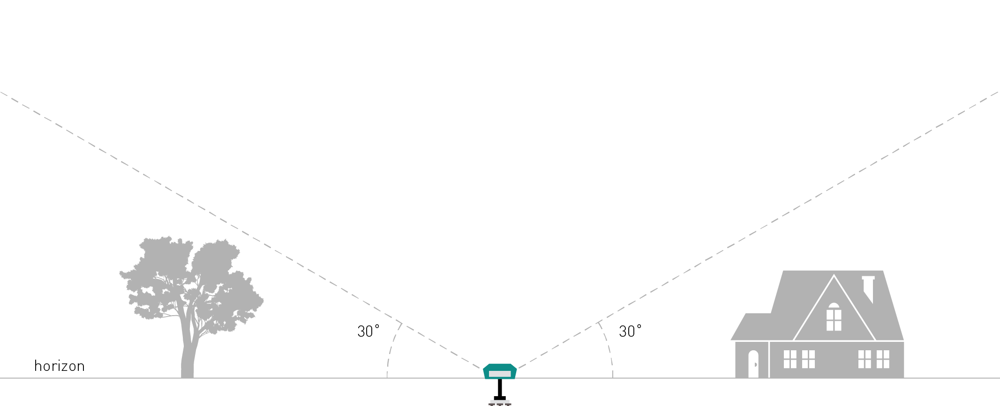
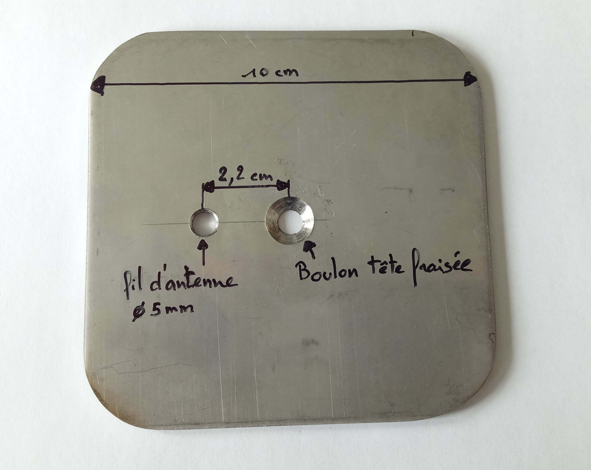
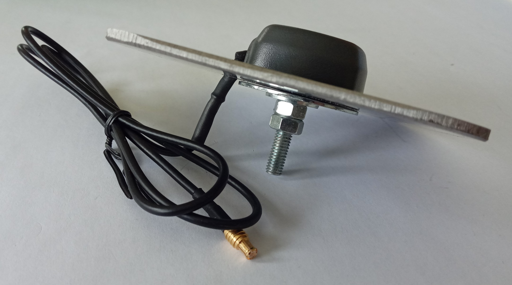
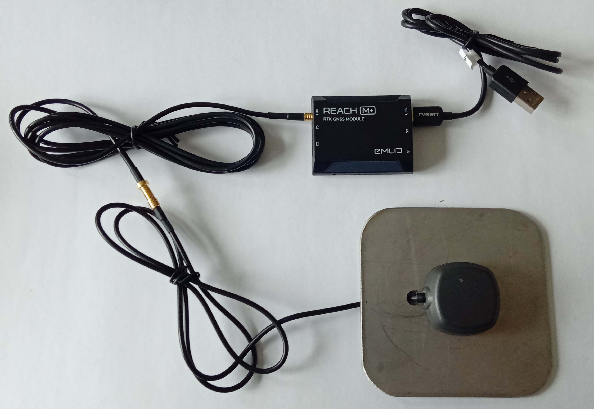
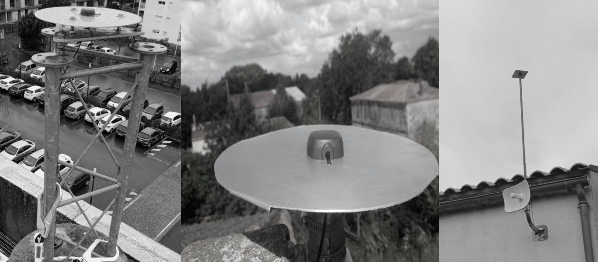
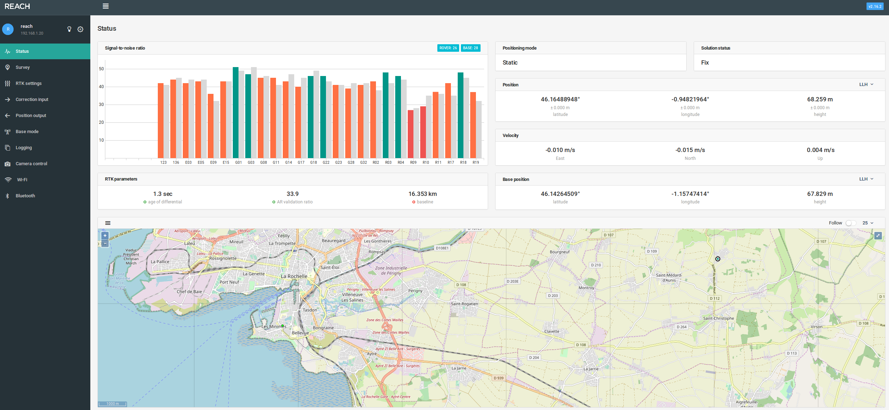
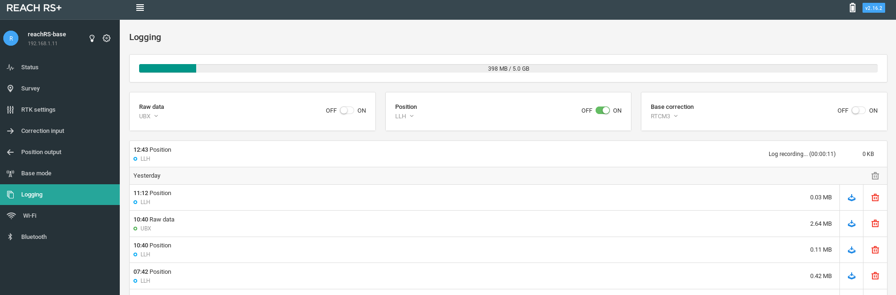
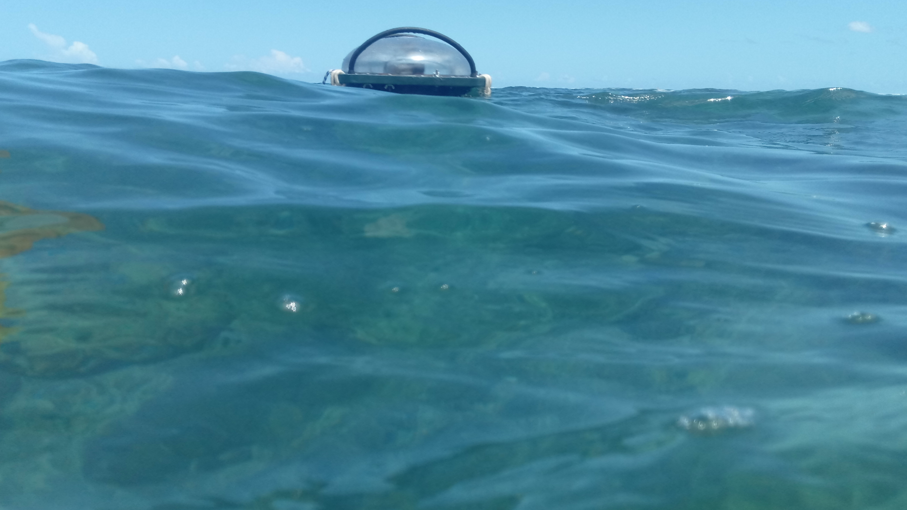
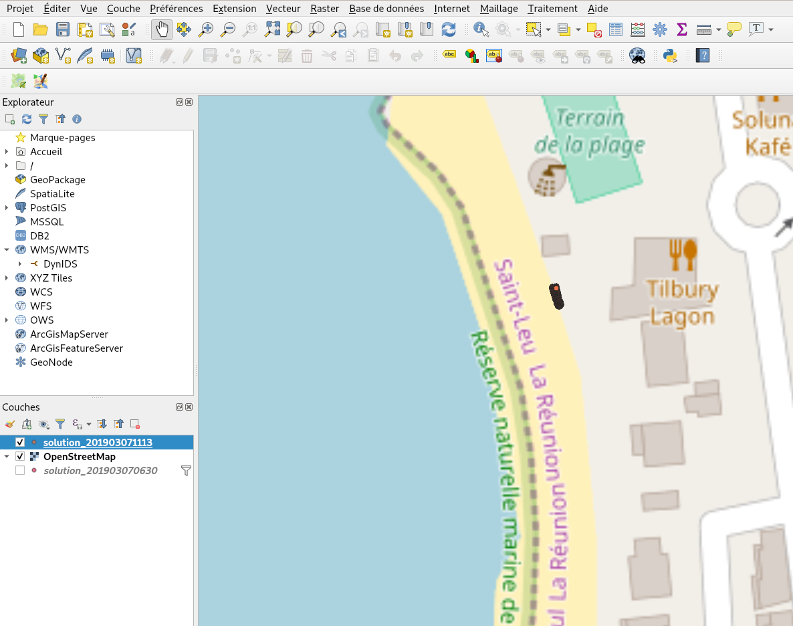

# Mise en place d'une antenne RTK (exemple du site de Saint-Leu - Ifremer - Réunion)

Licence: [AGPL-3.0](https://github.com/jancelin/centipede/blob/master/LICENSE)

## Matériel utilisé

Voici la liste des éléments nécessaires à la mise en place d'une base RTK :

|Matériel|Prix HT|
|--------|----|
|[Emlid Reach M+](https://store.emlid.com/product/reachm-plus/)|240€|
|[Tallysman multi-GNSS antenna](https://store.emlid.com/product/tallysman-multi-gnss-antenna/)|54€|
|[Câble d'extension d'antenne](https://store.emlid.com/product/reach-antenna-extension-cable-2m/)|11€|
|[Feuille aluminium (plan de masse)](https://fr.rs-online.com/web/c/abrasifs-materiaux-techniques/tubes-feuilles-et-angles-en-aluminium/feuilles-en-aluminium/?searchTerm=aluminium&sort-by=P_breakPrice1&sort-order=asc&applied-dimensions=4294555449)|12€|
|[Alimentation](https://fr.rs-online.com/web/p/adaptateurs-ac-dc/1770223/)|6€|
|En Option||
|[Dissipateur chaleur](https://fr.rs-online.com/web/p/dissipateurs-de-chaleur/1263113/)|13€|
|[Pâte thermique](https://fr.rs-online.com/web/p/graisse-thermique/0554311/)|7€|

> scratch 3M ?

Un accès WIFI proche de la base est indispensable pour assurer la connexion du récepteur au réseau internet. Si ce n'est pas le cas, il est possible d'utiliser des CPL ethernet et wifi pour se déporter le réseau wifi vers la zone d'installation de votre antenne. Attention, dans cette configuration le CPL doit être connecté sur la même phase de votre réseau électrique que votre point d'accès à internet (Box).

> Exemple d'utilisation d'un RPI pour les réseaux wifi institutionnels ?

## Choix de la zone d'implantation

La zone d'implantation de l'antenne de réception ne nécessite pas une position dominante, mais doit proposer une visibilité maximum du ciel ; il est indispensable de ne pas avoir d'obstacles (bâtiments, arbres, murs ...) sous les 30 premiers degrés par rapport à la base de l'antenne.

<p align="center"></p>

## Installation du module

L'antenne [Tallysman multi-GNSS antenna](https://store.emlid.com/product/tallysman-multi-gnss-antenna/) doit être placée sur un plan de masse en métal ([préconisation du constructeur](http://www.tallysman.com/wp-content/uploads/Embedded-Antennas-Reference-Guide.pdf)) de 10 cm afin d'améliorer la réception des données satellitaires. Il peut être fabriqué en aluminium, inox ou cuivre. Il doit disposer d'un trou central pour le fixer avec un boulon tête fraisée sur un support (mât, toiture, borne béton...) et d'un deuxième trou pour faire passer le fil de l'antenne.
> [Note pour plus tard](https://www.fig.net/resources/proceedings/fig_proceedings/fig2017/ppt/ts08c/TS08C_zhang_schwieger_8513_ppt.pdf)

<p align="center"></p>

<p align="center"></p>

Coller ensuite l'antenne sur le plan de masse, rajouter le câble d'extension de 2 mètres si nécessaire (en fonction de la configuration de pose) et connecter le Reach M+.

<p align="center"></p>

Le Reach M+ est positionné dans un endroit abrité du soleil direct et de la pluie, si possible en intérieur et dans une zone lui permettant de capter le signal wifi de votre box ou accessible avec un cable ethernet ([exemple de montage](https://github.com/jancelin/centipede/blob/master/tuto/ethernet.md))

<p align="center"></p>

Voici plusieurs exemples de montage de bases RTK :

<p align="center"></p>
<p align="center"><sup><i>https://centipede.fr</i></sup></p>

En cas de montage extérieur, il est important de rajouter un dissipateur de chaleur sur le module RTK. La procédure de montage est disponible ici:

[Installation d'un dissipateur thermique](https://github.com/jancelin/centipede/blob/master/tuto/cold_base_rtk.md)

## Premières configurations

Le Reach M+ est mis sous tension.

* Se connecter au réseau wifi du Reach ("reach:xx:xx") en utilisant le mot de passe __emlidreach__.

* Ouvrir un navigateur (de préférence Mozilla Firefox ou Google Chrome) et taper http://reach.local ou http://192.168.42.1 pour accéder à l'interface de configuration du reach (cf. image ci-dessous).

<p align="center"></p>

* Cliquer sur le bouton + et entrer le SSID de votre réseau wifi, le type de sécurité et le mot de passe. Cliquer sur le bouton Save.

* Sélectionner votre réseau wifi et cliquer sur Connect.

* Une fois le reach connecté sur votre réseau wifi, une nouvelle IP lui est attribuée ; c'est celle-ci qui est utilisée par la suite (http://reach.local fonctionne également). Cette IP est visible sur l'interface Web du Reach, en haut à gauche de l'écran.

<p align="center"></p>

> Note : il est également possible de faire ces manipulations via l'application ReachView (disponible sur Android et iOS) sur une tablette ou un smartphone.

## Calcul de la position de la base

### Paramétrage de la position des satellites

<p align="center"></p>

La valeur du *Update rate* conditionne le nombre de mesures par seconde. 

### Récupération des données nécessaires

Afin d'utiliser le reach en tant que base fixe, il est indispensable de définir ses coordonnées le plus précisément possible.
Pour ce faire, nous activons l'enregistrement des positions dans la rubrique logging, en activant l'option *Raw data* (position ON). Les options *Position* et *Base correction* ne doivent pas être activées pour l'instant.

<p align="center"></p>

L'enregistrement se fait pendant une période minimale de 12h00 consécutives. Les positions enregistrées sont ensuite post-traitées en s'appuyant sur la trame de l'antenne RGP la plus proche (IGN - <a href="http://rgp.ign.fr">En savoir plus</a>), enregistrée sur la même période. Plus l'antenne de référence sera proche, meilleure sera la précision de localisation de notre base.

Plusieurs méthodes de post-traitements existent, et ce sont les conditions locales (éloignement de l'antenne de référence, modèle de l'antenne,  visibilité de la constellation ...) qui aident à déterminer la méthode la plus pertinente.

* Télécharger le fichier UBX (Raw_xxx_UBX.zip) en cliquant sur l'icône 
> Le téléchargement n'est possible qu'en stoppant préalablement les logs (*Raw Data* sur OFF).

* Aller sur le <a href="http://rgp.ign.fr/DONNEES/diffusion">site IGN</a> et télécharger la trame correspondante à la période.

* Sélectionner UT (Temps Universel)

* Sélectionner GLONASS en plus de GPS (+ GALILEO si la base concernée le propose). Si un système sélectionné (ex : GALILEO) n'est pas disponible sur la base concernée, celle-ci disparait de l'interface cartographique et n'est donc plus sélectionnable. Dans ce cas, décocher le système de positionnement.

* Échantillonnage : 5 sec.

* Version Rinex : 2.11

* Il faut ensuite sélectionner la base souhaitée sur la carte à l'aide de l'outil de sélection () puis l'ajouter au panier.

* Télécharger l'archive au format ZIP une fois celle-ci disponible.

<p align="center"></p>

* Réunir les 2 fichiers (UBX + Rinex) dans un même répertoire.

> Pour en savoir plus sur les formats UBX et Rinex : <a href="https://en.wikipedia.org/wiki/RINEX">wikipedia</a>

### Calcul de la correction

Télécharger la version d'RTKLIB fournie par EMLID : <a href="https://docs.emlid.com/reachm-plus/common/tutorials/gps-post-processing/" target="new_">docs.emlid.com</a>.

1 - __RTKCONV__

```
./RTKCONV_Qt-x86_64.AppImage
```

* Charger le fichier UBX
* Sélectionner le format u-blox
* Cliquer sur options puis changer la version Rinex (2.11 : celle de la base RGP)
* Cliquer sur Convert
* En sortie, nous récupérons 6 fichiers :
    - *.nav*, *.qnav*, *.lnav*, *.gnav*, *.hnav*, *.obs*

2 - __RTKPOST__

Deux méthodes sont proposées, l'une avec les fichiers récupérés 24 h après la collecte des données (positionnement précis) et la deuxième ces fichiers plus les fichiers de l'IGS récupérés 20 jours après la collecte des données donc un positionnement très précis (Solution combinée finale GNSS pour la solution orbitale combinée du système d'information sur la dynamique de la croûte terrestre (CDDIS)). 

2.1 - __Méthode à 24h__

```
./RTKPOST_Qt-x86_64.AppImage
```

* Charger le fichier *.obs* de la base à corriger (Rover)
* Charger le fichier *.19o* de la base de référence (Base Station)
* Charger les fichiers *.nav*, *.hnav*, *.gnav*, *.lnav* de la base à corriger
* Le fichier résultat aura une extension *.pos*
* Renseigner le *Time Start* et le *Time End* (la plage horaire de notre période de logging).
* Cliquer sur __options__
  - __Setting1__
       - *Positionning Mode* : Static 
       - *Fréquencies* : L1 + Forward (valeur par défaut) 
       - *Elevation mask* : valeur configurée pour le reach (15° par défaut) 
       - *Ionosphere correction* : Broadcast  
            > Correction de l'effet de l'ionosphère. Il est conseillé d'utiliser le mode Broadcast (modèle utilisé en temps réel et disponible dans le fichier de navigation) ou Dual-Frequancy (si des mesures ou plusieurs fréquences sont disponibles).
            > Source : IGN cf. http://cours-fad-public.ensg.eu/mod/imscp/view.php?id=450 (Analyse GNSS sous RTKLIB, Fenêtre options)
       - *Troposphere correction* : Saastamoinen 
            > Correction de l'effet de la troposphère. Il est conseillé d'utiliser le mode Saastamoinen en positionnement utilisant des mesures de code ou en positionnement relatif avec de courtes lignes de base et de faibles dénivelés ; dans le cas contraire, on peut utiliser les modes Estimate ZTD ou Estimate ZTD+Grad (estimation de paramètres troposphériques).
            > Source : IGN cf. http://cours-fad-public.ensg.eu/mod/imscp/view.php?id=450 (Analyse GNSS sous RTKLIB, Fenêtre options)
       - Pour les autres options, laisser les valeurs par défaut 
  - __Setting2__
       - *Integer Ambiguity Res* : Fix and Hold
            > Stratégie de résolution des ambiguïtés. Les stratégies Continuous et Fix ans Hold sont les plus concluantes.
            > Source : IGN cf. http://cours-fad-public.ensg.eu/mod/imscp/view.php?id=450 (Analyse GNSS sous RTKLIB, Fenêtre options)
            >
            > (cf. aussi RTKLIB explorer qui privilégie le Continuous https://rtklibexplorer.wordpress.com/2016/04/05/rtklib-thoughts-on-fix-and-hold/
            >   https://rtklibexplorer.wordpress.com/2016/05/02/another-kayak-data-set-fix-and-hold-fails-again/   http://rtkexplorer.com/improving-rtklib-solution-ar-lock-count-and-elevation-mask/ ) 
       - Toutes les autres options doivent rester par défaut
  - __Output__ : laisser les valeurs par défaut 
  - __Statistics__ : laisser les valeurs par défaut 
  - __Positions__ 
       - Changer la valeur de *Base station* : Rinex Header Position 
  - __Files__ : laisser les valeurs par défaut 
  - __Misc__ : laisser les valeurs par défaut
 
> Penser à sauvegarder tous ces paramétrages dans un fichier .conf (option Save)

2.2 - __Méthode après 20 jours__

* Récupérer la date GPS de la collecte de données: http://navigationservices.agi.com/GNSSWeb/
> par exemple le 5 février 2019 correspond au 2039:2
* se rendre sur le site ftp://cddis.nasa.gov/gnss/products/
* chercher le dossier correspondant à la date GPS et l'ouvrir
> dans notre exemple 2032
* Chercher le Fichier :igs"dategps+jour".sp3.Z , télécharger le et décompressez-le
> dans l'exemple: Fichier :igs20392.sp3.Z > igs20392.sp3
* Ouvrir RTKPOST
```
./RTKPOST_Qt-x86_64.AppImage
```

* Charger le fichier *.obs* de la base à corriger (Rover)
* Charger le fichier *.19o* de la base de référence (Base Station)
* Charger les fichiers *.nav*, *.hnav*, *.gnav*, *igs20392.sp3* de la base à corriger
* Renseigner le *Time Start* et le *Time End* (la plage horaire de notre période de logging).
* Reprendre la procédure décrite précédemment (2.1 __Méthode à 24h__) au niveau de * Cliquer sur __options__

  
 3 - __RTKPLOT__ 
 
 ```
./RTKPLOT_Qt-x86_64.AppImage
```
 
 Pour cartographier le nuage de points obtenu précédemment (fichier avec extension pos).
 
 Il est possible à ce stade-là de filtrer les données afin de ne conserver que les points pour lesquels la valeur de Q est égale à 1 (ie. mode FIX) et le ratio est maximal (ie. proche de 999).
 
 4 - __QGIS__
 
 Le fichier résultat peut être exploité dans QGIS.
 
 > Plus d'informations sur l'installation de ce logiciel sur cette <a href="https://doc.ubuntu-fr.org/qgis" target="new_">page</a>
 
   - Cliquer sur *couche* > *Ajouter une couche* > *Ajouter une couche de texte délimité*
   - Choisir le fichier .pos puis cliquer sur *Ouvrir*
        
<p align="center"></p>      

   - Dans *Format de fichier*, sélectionner le délimiteur *Espace*
   - Fixer la valeur du *Nombre de lignes à ignorer* à 12
   - Cocher l'option "Entêtes en 1ere ligne"
   - Renseigner le *champ X* : longitude
   - Renseigner le *champ Y* : latitude
   - Cliquer sur *OK* (une nouvelle fenêtre s'ouvre)
   - Sélectionner le SRC 4326 (WGS 84) en utilisant le filtre
   - Cliquer sur *OK*

<p align="center"></p>      

   - Faire un clic droit sur la couche puis *Filtrer...*
   - Ajouter le filtre suivant :
 ```
 "Q" = 1 AND
 "ratio" >= 999 AND
 "sdun(m)" = 0 -- AND
 -- "sdeu(m)" = 0 AND
 -- "sdne(m)" = 0 AND
 -- "sdu(m)" = 0  AND 
 -- "sde(m)" = 0  AND 
 -- "sdn(m)" = 0

  ```
   - Cliquer sur *OK*
   
On retrouve ici les points affichés dans RTKPLOT suite à l'application des mêmes filtres (mode FIX et AR Ratio > 999).
   
<p align="center"></p>      

   - Cliquer sur *vecteur* > *Outils d'analyse* > *Statistiques basiques pour les champs*
        - *Couche vectorielle en entrée* : choisir le fichier pos
        - *Champ pour le calcul des statistiques* : latitude
        - *Statistiques* > *Enregistrer vers un fichier* et créer un fichier latitude.html (par exemple)
        - Cliquer sur *Run*
   - Répéter l'opération avec les champs longitude et hauteur.

<p align="center"></p>  

Nous obtenons ainsi trois fichiers contenant les statistiques basiques sur les trois paramètres de localisation : longitude.html, latitude.html et height.html.

La position la plus précise de notre base est donnée par la valeur de la médiane de chaque dimension.

<p align="center"></p>  

 5 - __Insertion des coordonnées corrigées__
 
 Ces valeurs doivent être enregistrées dans la rubrique *Base mode* de l'interface du Reach.
 
   Dans l'onglet *Base coordinates* (LLH), mettre le *Coordinates input mode* sur Manual puis enregistrer les valeurs de longitude, latitude et hauteur.
   
   <p align="center"></p>
 
> Dans nos conditions expérimentales, nous avons obtenu une précision inférieure à 1 centimètre. :+1:

## Connexion de la base au caster

Avant de pouvoir utiliser le réseau Centipède il est indispensable de faire une demande de connection au Caster (gratuit et sans obliations). les de demandes sont à envoyer à contact@centipede.fr en précisiant:

    - Votre situation géographique (commune)
    - Nom, prénom
    - Adresse mail
    - Type de matériel utilisé pour la base RTK
    - Proposition de nom de Mout Point ( entre 3 et 5 caractères)

Pour connecter la base au caster, se rendre dans la rubrique *Base mode* de l'interface du reach :

<p align="center"></p>

Modifier les valeurs suivantes (en se basant sur les paramètres enregistrés dans *ntripcaster.conf*)

   - Choisir l'option *NTRIP*
   - Indiquer l'URL du caster dans le champ *Address* : caster.centipede.fr
   - Choisir le port 2101
   - Indiquer le mot de passe: centipede
   - Choisir/Indiquer le nom du Mount point
 
## Mise en oeuvre du rover

> Il est conseillé de renommer chacun des reach dans la rubrique *Control panel* de l'interface (cliquer sur l'icône ) puis *General settings* > *Edit*.

La base fixe étant opérationnelle, il est possible de déployer un ou plusieurs reach mobiles ("rover") pour se déplacer en bénéficiant d'un positionnement centimétrique. Ceci est possible dans un rayon de 10 kilomètres autour de la base.

Pour cela, le paramétrage du reach est semblable à celui de la base, en suivant les étapes décrites plus haut dans la rubrique *premières configurations*.

Il n'est pas nécessaire de calibrer la position du rover ; celle-ci sera corrigée en temps réel en récupérant la trame fournie par la base, en éditant les paramètres de la rubrique *Input correction*

<p align="center"></p>

- Choisir l'option *NTRIP*
- Indiquer l'URL du caster dans le champ *Address*: caster.centipede.fr
- Choisir le port 2101
- Sélectionner le format *RTCM3* pour la trame reçue
- Indiquer le nom de la base RTK dans MountPoint 

exemple du status

<p align="center"></p>

Le rover est prêt à être utilisé : 

 - Dans la rubrique Logging, activer l'option *Position* (bouton sur ON).
 
<p align="center"></p>

 - Avant de commencer l'acquisition de données, il est préférable d'attendre d'obtenir un *Solution status* à FIX et un *AR ratio* > 999.

Ci-dessous, exemple du rover construit pour être immergé :

<p align="center"></p>

Un dissipateur de chaleur et un ventilateur ont été ajoutés :

<p align="center"></p>

Le rover en mode *Survey* dans le lagon de Saint-Leu :

<p align="center"></p>

Un exemple de relevés en mode fix :

Localisation générale (Réserve marine de Saint-Leu) :

<p align="center"></p>

Zoom à l'échelle 1:26 :

<p align="center"></p>

Autre test sur une table de 50cm X 50cm

<p align="center"></p>

