# Mise en place d'une antenne RTK (site de Saint-Leu - Ifremer - Réunion)

*Modèle Emlid Reach M+ - v2.16.2*

## Installation du module

La température locale et l'humidité relative étant très élevées, il est nécessaire de retirer le module du boitier et de lui adjoindre un ventilateur équipé d'un dissipateur, comme présenté ci-dessous.

<p align="center">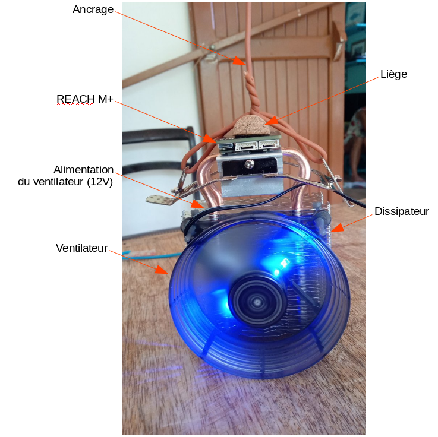</p>

L'antenne est placée sur un mât et le reach est positionné dans un endroit abrité du soleil direct et de la pluie.

<p align="center">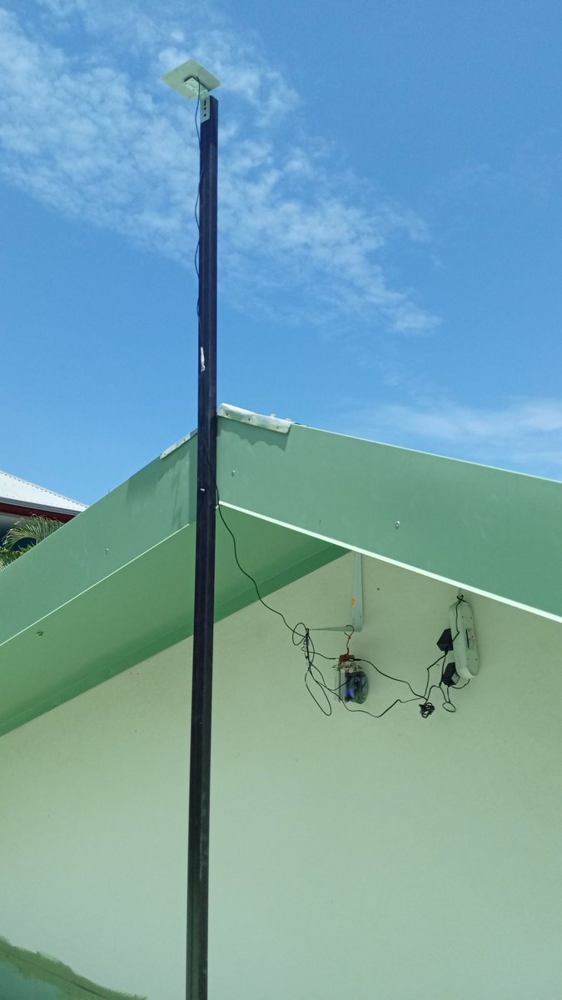</p>

## Premières configurations

Le reach est mis sous tension.

* Se connecter au réseau wifi du Reach ("reach:xx:xx") en utilisant le mot de passe __emlidreach__.

* Ouvrir un navigateur (de préférence Mozilla Firefox ou Google Chrome) et taper http://reach.local ou http://192.168.42.1 pour accéder à l'interface de configuration du reach (cf. image ci-dessous).

<p align="center"></p>

* Cliquer sur le bouton + et entrer le SSID de votre réseau wifi, le type de sécurité et le mot de passe. Cliquer sur le bouton Save.

* Sélectionner votre réseau wifi et cliquer sur Connect.

* Une fois le reach connecté sur votre réseau wifi, une nouvelle IP lui est attribuée ; c'est celle-ci qui est utilisée par la suite (http://reach.local fonctionne également). Cette IP est visible sur l'interface Web du Reach, en haut à gauche de l'écran.

<p align="center">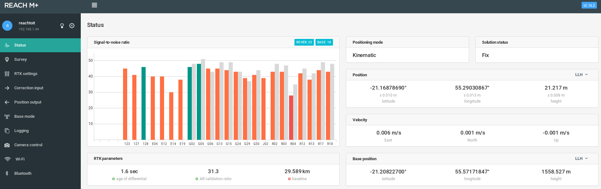</p>

> Note : il est également possible de faire ces manipulations via l'application ReachView (disponible sur Android et iOS) sur une tablette ou un smartphone.

## Calcul de la position de la base

### Paramétrage de la position des satellites

<p align="center"></p>

La valeur du *Update rate* conditionne le nombre de mesures par seconde. 

### Récupération des données nécessaires

Afin d'utiliser le reach en tant que base fixe, il est indispensable de définir ses coordonnées le plus précisément possible.
Pour ce faire, nous activons l'enregistrement des positions dans la rubrique logging, en activant l'option *Raw data* (position ON). Les options *Position* et *Base correction* ne doivent pas être activées pour l'instant.

<p align="center">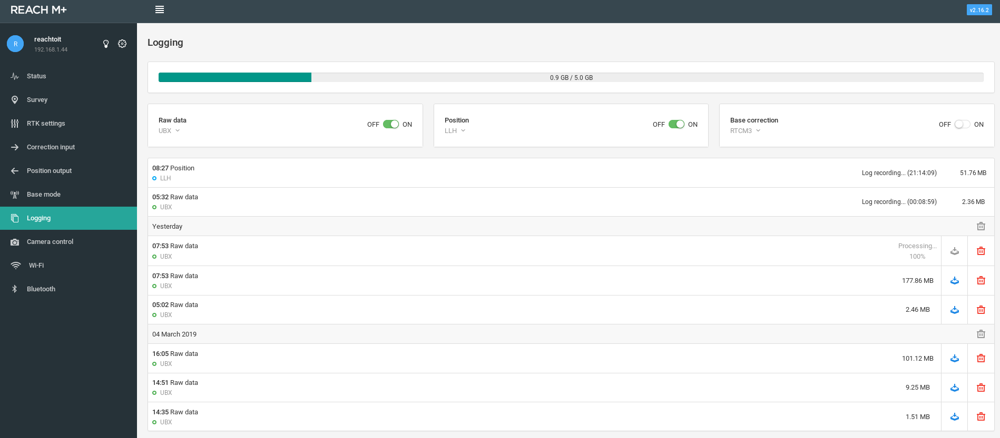</p>

L'enregistrement se fait pendant une période minimale de 12h00 consécutives. Les positions enregistrées sont ensuite post-traitées en s'appuyant sur la trame de l'antenne RGP la plus proche (IGN - <a href="http://rgp.ign.fr">En savoir plus</a>), enregistrée sur la même période. Plus l'antenne de référence sera proche, meilleure sera la précision de localisation de notre base.

Plusieurs méthodes de post-traitements existent, et ce sont les conditions locales (éloignement de l'antenne de référence, modèle de l'antenne,  visibilité de la constellation ...) qui aident à déterminer la méthode la plus pertinente.

* Télécharger le fichier UBX (Raw_xxx_UBX.zip) en cliquant sur l'icone 
> Le téléchargement n'est possible qu'en stoppant préalablement les logs (*Raw Data* sur OFF).

* Aller sur le <a href="http://rgp.ign.fr/DONNEES/diffusion">site IGN</a> et télécharger la trame correspondante à la période.

* Sélectionner UT (Temps Universel)

* Sélectionner GLONASS en plus de GPS (+ GALILEO si la base concernée le propose). Si un système sélectionné (ex : GALILEO) n'est pas disponible sur la base concernée, celle-ci disparait de l'interface cartographique et n'est donc plus sélectionnable. Dans ce cas, décocher le système de positionnement.

* Echantillonnage : 5 sec.

* Version Rinex : 2.11

* Il faut ensuite sélectionner la base souhaitée sur la carte à l'aide de l'outil de sélection (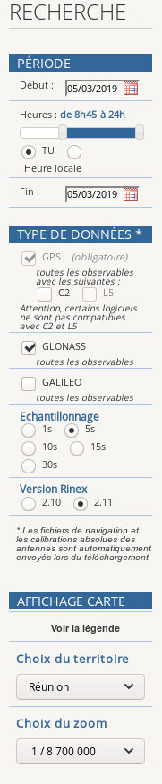) puis l'ajouter au panier.

* Télécharger l'archive au format ZIP une fois celle-ci disponible.

<p align="center">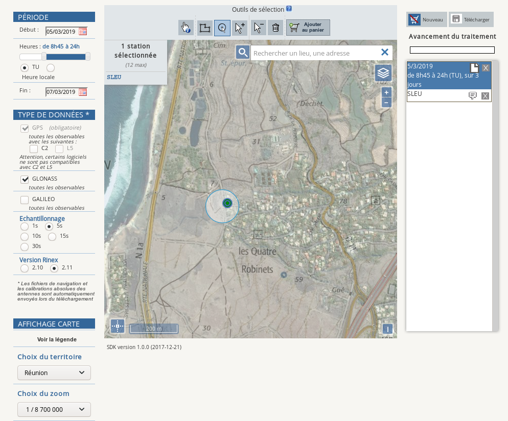</p>

* Réunir les 2 fichiers (UBX + Rinex) dans un même répertoire.

> Pour en savoir plus sur les formats UBX et Rinex : <a href="https://en.wikipedia.org/wiki/RINEX">wikipedia</a>

### Calcul de la correction

Télécharger la version d'RTKLIB fournie par EMLID : <a href="https://docs.emlid.com/reachm-plus/common/tutorials/gps-post-processing/" target="new_">docs.emlid.com</a>.

1 - __RTKCONV__

```
./RTKCONV_Qt-x86_64.AppImage
```

* Charger le fichier UBX
* Sélectionner le format u-blox
* Cliquer sur options puis changer la version Rinex (2.11 : celle de la base RGP)
* Cliquer sur Convert
* En sortie, nous récupérons 6 fichiers :
    - *.nav*, *.qnav*, *.lnav*, *.gnav*, *.hnav*, *.obs*

2 - __RTKPOST__

```
./RTKPOST_Qt-x86_64.AppImage
```

* Charger le fichier *.obs* de la base à corriger (Rover)
* Charger le fichier *.19o* de la base de référence (Base Station)
* Charger les fichiers *.nav*, *.hnav*, *.lnav*, *.gnav* de la base à corriger
* Le fichier résultat aura une extension *.pos*
* Renseigner le *Time Start* et le *Time End* (la plage horaire de notre période de logging).
* Cliquer sur __options__
  - __Setting1__
       - *Positionning Mode* : Static 
       - *Fréquencies* : L1 + Forward (valeur par défaut) 
       - *Elevation mask* : valeur configurée pour le reach (15° par défaut) 
       - *Ionosphere correction* : Broadcast  
            > A creuser 
       - *Troposphere correction* : Saastamoinen 
       - Pour les autres options, laisser les valeurs par défaut 
  - __Setting2__
       - *Integer Ambiguity Res* : Continuous 
            > A creuser (cf. RTKLIB explorer) 
       - Toutes les autres options doivent rester par défaut
  - __Output__ : laisser les valeurs par défaut 
  - __Statistics__ : laisser les valeurs par défaut 
  - __Positions__ 
       - Changer uniquement la valeur de *Base station* : Rinex Header Position 
  - __Files__ : laisser les valeurs par défaut 
  - __Misc__ : laisser les valeurs par défaut
 
> Penser à sauvegarder tous ces paramétrages dans un fichier .conf (option Save)
  
 3 - __RTKPLOT__ 
 
 ```
./RTKPLOT_Qt-x86_64.AppImage
```
 
 Pour cartographier le nuage de points obtenu précédemment (fichier avec extension pos).
 
 Il est possible à ce stade-là de filtrer les données afin de ne conserver que les points pour lesquels la valeur de Q est égale à 1 (ie. mode FIX) et le ratio est maximal (ie. proche de 999).
 
 4 - __QGIS__
 
 Le fichier résultat peut être exploité dans QGIS.
 
 > Plus d'informations sur l'installation de ce logiciel sur cette <a href="https://doc.ubuntu-fr.org/qgis" target="new_">page</a>
 
   - Cliquer sur *couche* > *Ajouter une couche* > *Ajouter une couche de texte délimité*
   - Choisir le fichier .pos puis cliquer sur *Ouvrir*
        
<p align="center">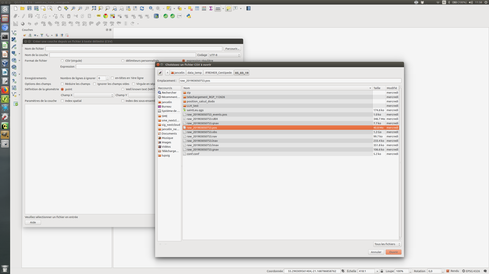</p>      

   - Dans *Format de fichier*, sélectionner le délimiteur *espace*
   - Fixer la valeur du *Nombre de lignes à ignorer* à 12
   - Cocher l'option "Entêtes dans la 1ere ligne"
   - Renseigner le *champ X* : longitude
   - Renseigner le *champ Y* : latitude
   - Cliquer sur *ok* (une nouvelle fenêtre s'ouvre)
   - Sélectionner le SRC 4326 (WGS 84) en utilisant le filtre
   - Cliquer sur *ok*

<p align="center">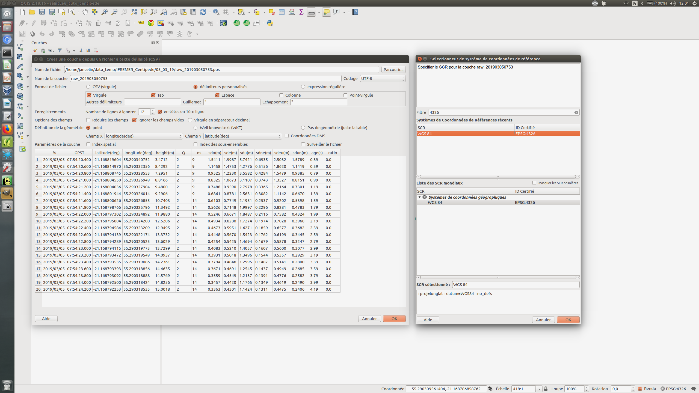</p>      

   - Faire un clic droit sur la couche puis *Filtrer...*
   - Ajouter le filtre suivant :
 ```
 "Q" = 1 AND
 "ratio" >= 999
  ```
   - Cliquer sur *OK*
   
On retrouve ici les points affichés dans RTKPLOT suite à l'application des mêmes filtres (mode FIX et AR Ratio > 999).
   
<p align="center">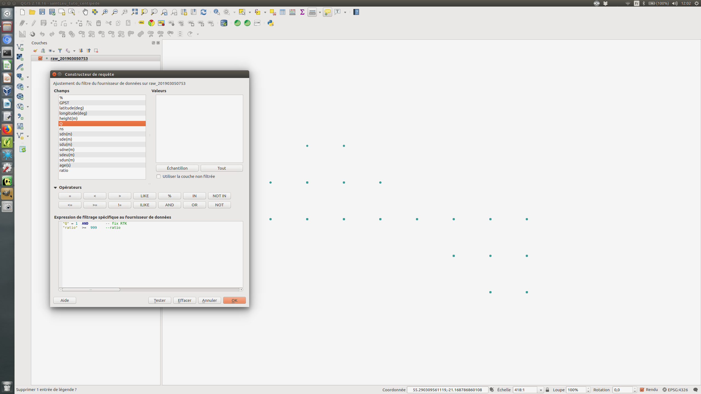</p>      

   - Cliquer sur *vecteur* > *Outils d'analyse* > *Statistiques basiques pour les champs*
   - *Couche vectorielle en entrée* : choisir le fichier pos
   - *Champ pour le calcul des statistiques* : latitude
   - *Statistiques* > *Enregistrer vers un fichier* et créer un fichier latitude.html (par exemple)
   - Cliquer sur *Run*
   - Répéter l'opération avec les champs longitude et hauteur.

<p align="center">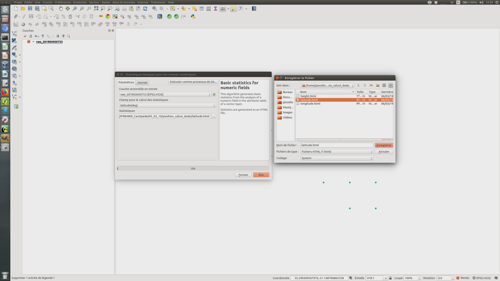</p>  

Nous obtenons ainsi trois fichiers contenant les statistiques basiques sur les trois paramètres de localisation.

La position la plus précise de notre base est donnée par la valeur de la médiane de chaque dimension.

<p align="center">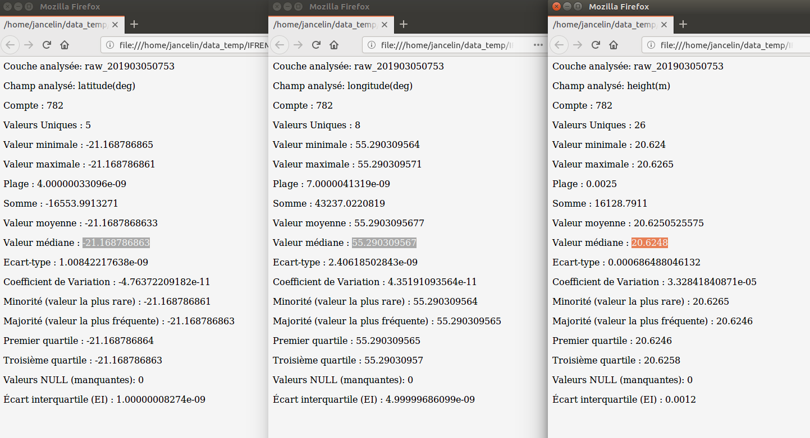</p>  

 5 - Insertion des coordonnées corrigées
 
 Ces valeurs doivent être enregistrées dans la rubrique *Base mode* de l'interface du Reach.
 
   Dans l'onglet *Base coordinates* (LLH), mettre le *Coordinates input mode* sur Manual puis enregistrer les valeurs de longitude, latitude et hauteur.
   
   <p align="center">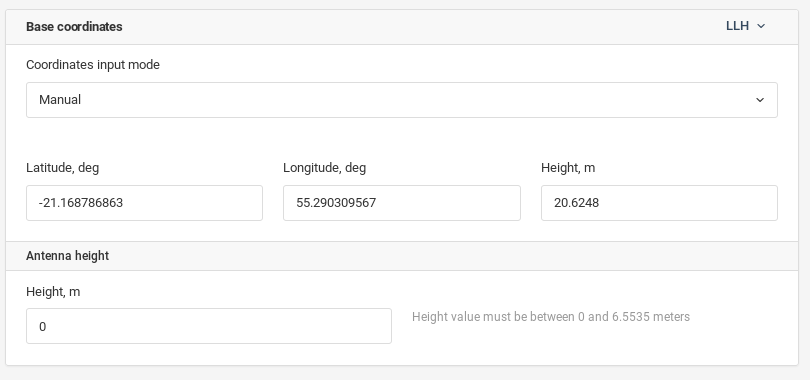</p>
 
> Dans nos conditions expérimentales, nous avons obtenu une précision inférieure à 1 centimètre. :+1:


## Installation du caster

### Prérequis du serveur

OS: Ubuntu-server 18.04

* Installer les paquets docker et docker-compose

La procédure est décrite à l'adresse <a href="https://docs.docker.com/install/linux/docker-ce/debian/" target="new_">docs.docker.com</a>

Il est nécessaire d'ouvrir le port 2101 de la machine.

### Déploiement du caster

L'application est conteneurisée avec docker, permettant un déploiement simple et rapide.

* Récupérer les codes de centipede :

``` 
git clone https://github.com/jancelin/centipede.git 
```

* Modifier le fichier de configuration :

```
cd centipede/ntripCaster
sudo nano ntripcaster.conf 
```
<p align="center">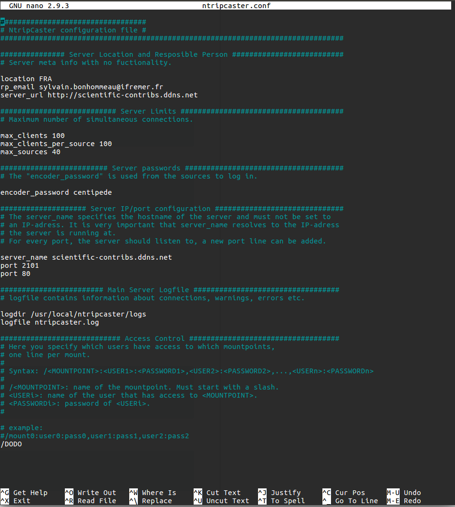</p>

   Modifier les valeurs suivantes :

    - server_url
    - email 
    - server_name 
    - mountpoint (à faire précéder du caractère /)
    - encoder_password (celui-ci est nécessaire pour connecter la base au caster)

* Modifier la liste des bases recensées par le caster

<p align="center">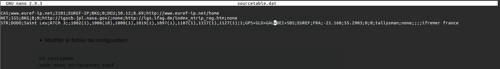</p>

```sudo nano sourcetab.dat```

```
STR;DODO;Saint Leu;RTCM 3;;1002(1),1006(10),1008(1),1019(1),1097(1),1107(1),1117(1),1127(1);1;GPS+GLO+GAL+BDS+SBAS;EUREF;FRA;-21.168;55.2903;0;0;tallysman;none;;;;ifremer france
```

Pour plus d'informations sur les différents paramètres à remplir: <a href="https://software.rtcm-ntrip.org/wiki/STR" target="new_">ttps://software.rtcm-ntrip.org</a>
    
> Un bug d'affichage non résolu persiste (cette liste ne s'affiche pas dans l'interface du reach) mais cette opération est nécessaire.
    
* Lancer la fabrication et le démarrage du caster avec les commandes suivantes :

```
docker-compose build 
docker-compose up -d
```
    
## Connexion de la base au caster

Pour tester le bon fonctionnement du caster, lancer la commande suivante :
``` 
docker-compose logs ntrip
```
<p align="center"></p>

Pour connecter la base au caster, se rendre dans la rubrique *Base mode* de l'interface du reach :

<p align="center">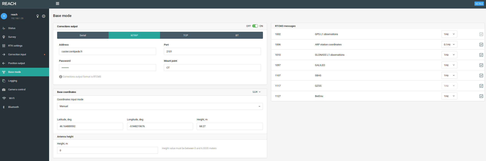</p>

Modifier les valeurs suivantes (en se basant sur les paramètres enregistrés dans *ntripcaster.conf*)

   - Choisir l'option *NTRIP*
   - Indiquer l'URL du caster dans le champ *Address*
   - Choisir le port 2101
   - Indiquer le nom du Mount point
 
## Mise en oeuvre du rover

La base fixe étant opérationnelle, il est possible de déployer un ou plusieurs reach mobiles ("rover") pour se déplacer en bénéficiant d'un positionnement centimétrique. Ceci est possible dans un rayon de 10 kilomètres autour de la base.

Pour cela, le paramétrage du reach est semblable à celui de la base, en suivant les étapes décrites plus haut dans la rubrique *premières configurations*.

Il n'est pas nécessaire de calibrer la position du rover ; celle-ci sera corrigée en temps réel en récupérant la trame fournie par la base, en éditant les paramètres de la rubrique *Input correction*

<p align="center">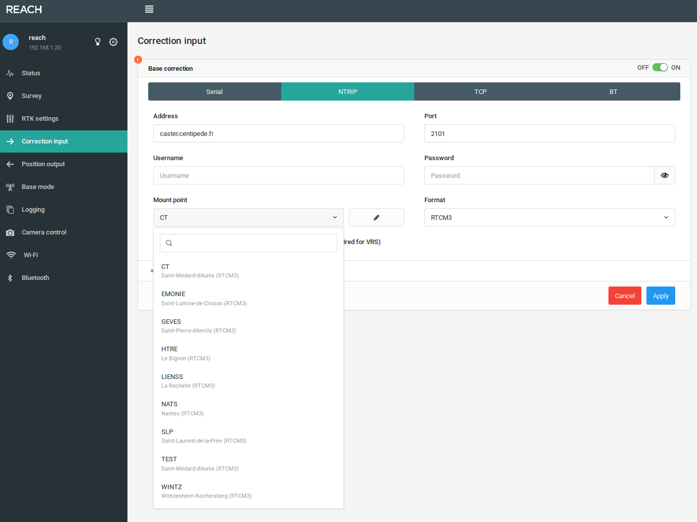</p>

- Choisir l'option *NTRIP*
- Indiquer l'URL du caster dans le champ *Address*
- Choisir le port 2101
- Sélectionner le format *RTCM3* pour la trame reçue

Ci-dessous, exemple du rover construit pour être immergé :

<p align="center"></p>

Un dissipateur de chaleur et un ventilateur ont été ajoutés :

<p align="center">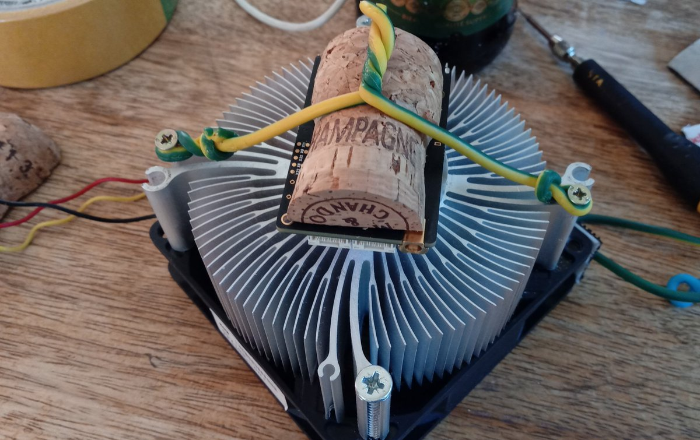</p>

> Il est conseillé de renommer chacun des reach dans la rubrique *Control panel* de l'interface (cliquer sur l'icône 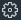) puis *General settings* > *Edit*.
